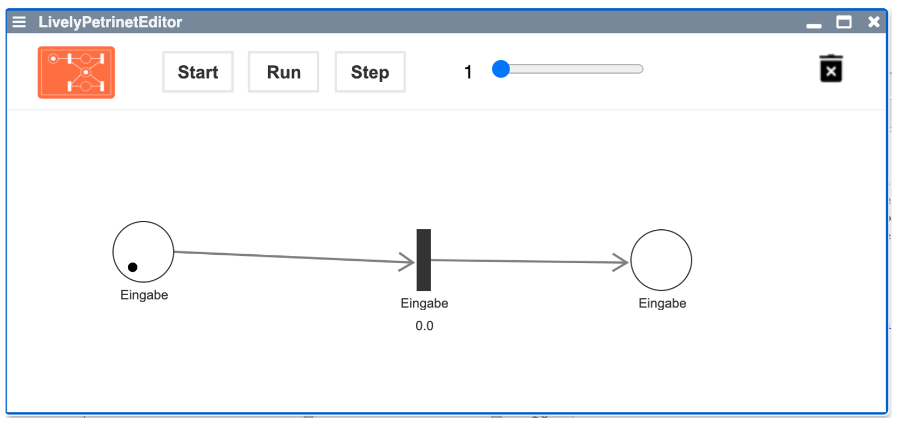

# EUD 2020 Seminar (HPI)

<lively-import src="../_navigation.html"></lively-import>

- [Project 1:   Lukas Fritzsche and Jonas Noack   **Material Point Method (improve debugging experience)**](project_1/) {.thumb} {.project}
- [Project 2:   Hendrik Schmidt and Nico Scordialo   **Non-linear Constraint Solving**](project_2/) {.thumb} {.project}
- [Project 3:   Linus Heinzl and Anne Radunski   **Petri Netze**](project_3/) {.thumb} {.project}
- [Project 4:   Leonardo Hübscher and Juliane Kleinknecht   **Lively Energy Simulation**](project_4/) {.thumb} {.project}

<lively-import src="../_logo.html"></lively-import>
<lively-import src="../_footer.html"></lively-import>

