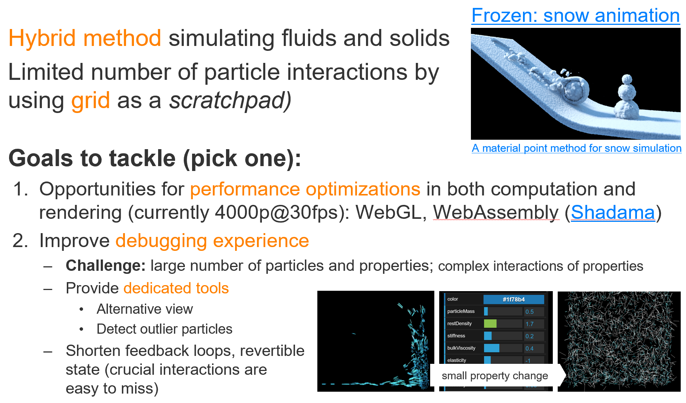

# Project 1: Lukas Fritzsche and Jonas Noack    *Material Point Method (improve debugging experience)*

## Starting Project

- http://onsetsu.github.io/floom/example.html

## Videos

- Grant Kot arbeitet seit Jahren an Simulationen und hat einige interessante Demo und Tutorials, hier seine [MPM PlayList](https://www.youtube.com/playlist?list=PLF37F5CAFE8DED424) (ist nur ein Teil seiner Videos)
- [Schneesimulation in Frozen](https://www.youtube.com/watch?v=1ES2Cmbvw5o)

## **Starting** Literature

### MPM Systems

Hier schonmal ein generelles Problem: Viele Paper beschreiben lediglich physikalische Formeln, die sich nicht unbedingt eins-zu-eins in Code übertragen lassen (z.B. viele Variablen sind als gegeben angenommen und nicht erklärt)

- [MLS-MPM](https://github.com/yuanming-hu/taichi_mpm#88-line-version-mit-license-download-c--javascript-versions) Implementierung mit vielen Code Beispielen
  - [simple MLS implementation in unity](https://nialltl.neocities.org/articles/mpm_guide.html), contains good overview and references
  - MLS benutzt lediglich Cell_Distance als Gewicht, benötigt dadurch aber weitere Informationen. Diese Information ist die Affine Momentum Matrix bekannt aus APIC (ein PIC Variante), was sehr gut in diesem [Paper](https://www.math.ucla.edu/~jteran/papers/JSSTS15.pdf) (Section 5.3) beschrieben ist (aber Vorsicht: Matrix-Formeln). Im Paper gibt es auch eine gute Tabelle mit den Symbolen für die genutzten physikalischen Attribute (awesome).
- Der [große Rückblick](./literature/mpm-review.pdf) auf 25 Jahre MPM. Bietet einen guten Gesamtüberblick.
- Original [Paper](https://www.sciencedirect.com/science/article/pii/0010465594001707)
- Ein [Paper](https://www.researchgate.net/profile/Pierre_Poulin/publication/220789321_Particle-based_viscoelastic_fluid_simulation/links/0c96051824f22359e2000000/Particle-based-viscoelastic-fluid-simulation.pdf), das generell recht viel Pseudo-Code enthält (wobei das meiste sich leider auf Springs bezieht):
- In diesem [Paper](https://www.osti.gov/servlets/purl/537397) sind im Appendix A.3 zwei Möglichkeiten beschrieben, Partikelwerte in das Grid hinein zu interpolieren (der Teil ist meiner Meinung nach auch echt gut beschrieben):
- Ein [Paper](./literature/mpm-julia.pdf) mit viel Code Routinen in Julia
  - viele Paper basieren auf Matlab (oder wie hier auf Julia), daher werden euch öfters einige mathematische Funktionen fehlen
- Paper zur Schneesimulation in [Frozen](https://www.math.ucla.edu/~jteran/papers/SSCTS13.pdf)
- es gab schonmal mind. einen [Workshop direkt zu MPM](https://www.mpmsim.com/?q=content/material-point-method). Die Seite bietet recht viele Links mit wichtigen Einstiegspapern.
  - Außerdem kann es sich lohnen, mal durch die Einreichungen des Workshops zu skimmen.
- Dieses [Paper](http://www.diva-portal.org/smash/get/diva2:1091115/FULLTEXT01.pdf) scheint eine gute Einführung yu Multi-Body Systemen zu haben
- ... (fill as needed)

### Visualisierungen

- Eine **Masterarbeit zum direkt Thema [Debugging](https://elib.uni-stuttgart.de/handle/11682/9505)** von Smooth Particle Hydro-Dynamics (nah dran und daher für das Projekt ein guter Ausgangspunkt)
- [Visual Debugging of Visualization Software: A Case Study for Particle Systems](./literature/VisualDebuggingOfVisualizationSoftwareACaseStudyForParticleSystems.pdf)
- ... (fill as needed)

#### Background/Inspiration/ für Visualisierungen/Behavior Comprehension

- DER Background zu program comprehension:
  - Norman: Gulf of Evaluation and Gulf of Execution
  - [Henry Lieberman and Christopher Fry: Bridging the Gulf Between Code and Behavior in Programming](./literature/Lieberman1995BridgingTheGulfBetweenCodeAndBehaviorInProgramming.pdf)
- Visual Information-Seeking Mantra
  - Key points
    - Overview
    - Zoom and Filter
    - Details on demand
    - View Relationships
    - History
    - Extract
  - [Original-Paper](./literature/Shneiderman_1996_TheEyesHaveItATaskByDataTypeTaxonomyForInformationVisualizations.pdf)
  - [Blogeintrag zu den ersten 3 Punkten](http://www.b-eye-network.com/view/2674)
- Whyline
- Omniscient Debugging
  - Query-based Debugging
- All of [Bret Victor`s work](http://worrydream.com/), especially
  - [Inventing On Principle](http://worrydream.com/#!/InventingOnPrinciple)
  - [Seeing Spaces](http://worrydream.com/#!/SeeingSpaces)
- Aggregate
- Mc Dirmid on [Time travel and stroboscopic views](./literature/McDirmid_2013_UsableLiveProgramming.pdf)

---

