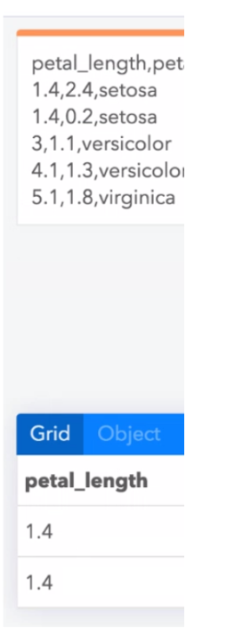

# Project 2: Hendrik Schmidt and Nico Scordialo  <br> *Non-linear Constraint Solving*

### Project Intro

[demo](https://lively-kernel.org/lively4/lively4-constraints/demos/contraints/index.md)

{style="float:right" height="400px"}

- Example Scenario
  - Bidirectional editing of data in source and derived views
  - Code that renders model data to view can is often non-linear
  - Transformations that allow to propagate edits back from the UI into the source data cannot be derived
- Code: 
  - ```parse_csv(read_text(‘iris.csv’).split(‘\n’)).filter( ea => ea.species == ‘setosa’)```
      0
- Demo: 
  - Editing the resulting table will reflect the contents of the csv
- Idea
  - Non-linear constraint solving allows for automatically adjusting the source data until it produces the required output
  - Backtracking, Hill climbing, Constraints, DataFlow
- Goal: Discuss and implement scenario and idea
- Examples
  - Carbide <https://alpha.trycarbide.com/>
  

- a) Data (CHANGE) -> Code (Non-linear function) -> UI (Table) (RESULT) #Standart
- b) Data -> Code (Non-linear function) (CHANGE)  -> UI (Table) (RESULT) #LiveProgrammingsheet
- d) Data (DELTA EFFECT) -> Code (Non-linear function)   -> UI (Table) (CHANGE) 
- e) Data -> Code (Non-linear function)  (DELTA EFFECT)  -> UI (Table) (CHANGE) 
  - idea: mark code and data "region" that can be adapted for backpropagation
  
  

## Table

<lively-table tabindex="0" class="">
<table><tbody><tr><th style="width: 40px">A</th><th style="width: 40px;"></th><th style="width: 40px" class="" contenteditable="false">B</th><th style="width: 40px" class="" contenteditable="true">Foo</th><th style="width: 40px">D</th><th style="width: 40px">E</th></tr>
<tr><td class=""></td><td></td><td></td><td class=""></td><td></td><td></td></tr><tr><td class="">First</td><td></td><td class="">Second</td><td class="">Third</td><td>Fourth</td><td></td></tr>
<tr><td>Hello</td><td></td><td class="">World</td><td class="">sfasdf</td><td class="">asdfdfa</td><td></td></tr>
<tr><td>Foo</td><td></td><td class="">Bar</td><td class=""></td><td></td><td></td></tr></tbody>
</table></lively-table>


<script>
(async () => {
  var table = await (<lively-table></lively-table>)
  table.setFromArray([["A","B"], ["1","2"]])
  return table
})()
</script>

## Editor

<script>
(async () => {
  var editor = await (<lively-code-mirror></lively-code-mirror>)
  editor.addEventListener("keydown", evt => {
    if (evt.ctrlKey && evt.key == "s") {
      lively.notify("Save is disabled...")
      evt.stopPropagation()
      evt.preventDefault()
    }
  })
  editor.value = "Hello"
  return editor
})()
</script>


