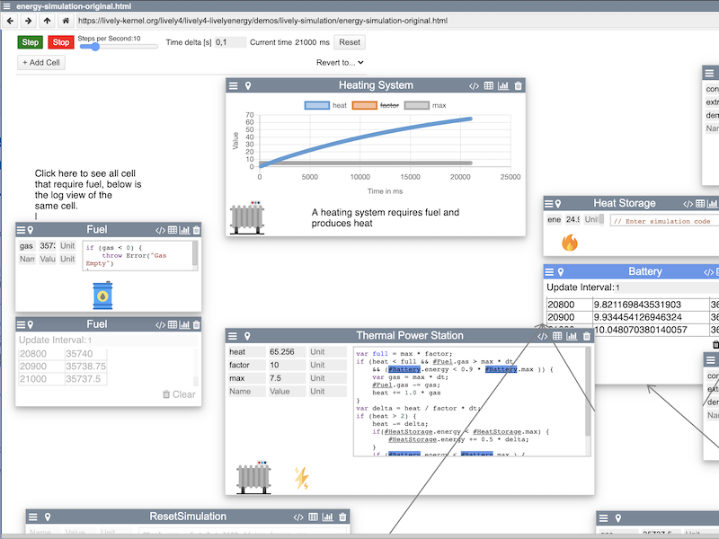

# Project 4: Leonardo Huebscher and Juliane Kleinknecht    *Lively Energy Simulation*

## References

- [Presentation](browse://demos/lively-simulation/presentation/index.md)
- [Readme](browse://demos/lively-simulation/index.md)
- [Demo](browse://demos/lively-simulation/energy-simulation-original.html)
- [Screencast](browse://demos/lively-simulation/presentation/demo.mp4)
- Code entry points: 
  - [lively-simulation](browse://src/components/demo/lively-simulation.js)
  - [Additional files](browse://demos/lively-simulation/)
- [Legacy Project (Lively Webwerkstatt)](https://lively-kernel.org/repository/webwerkstatt/demos/EnergySimulationScripted.xhtml)