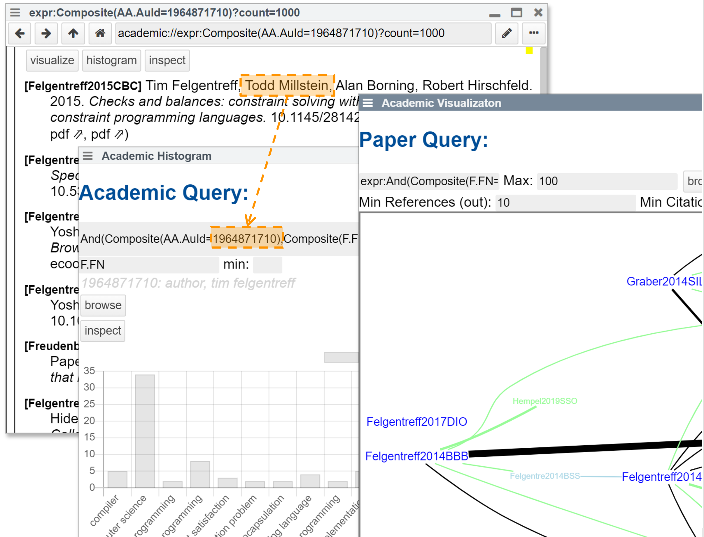
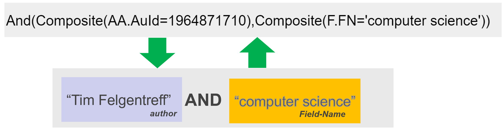
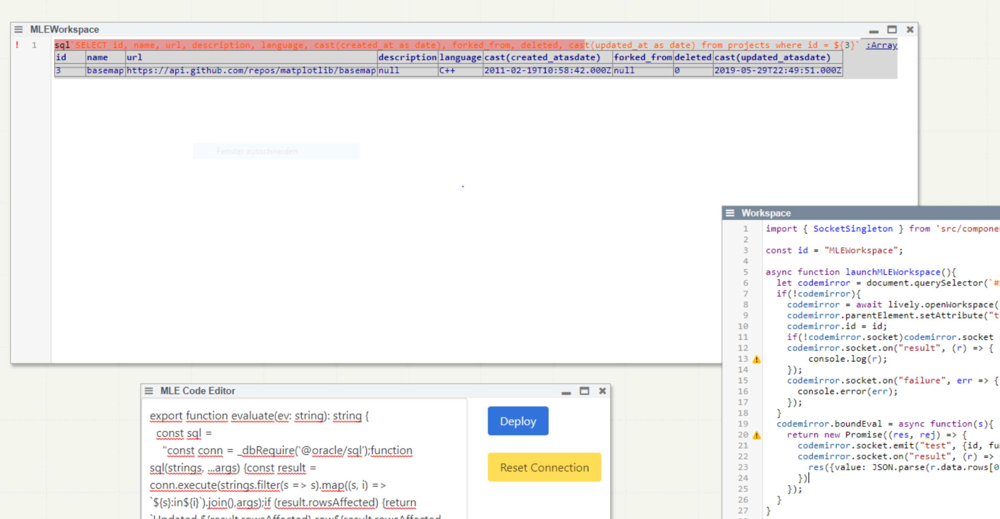

# PLCTE WiSe 2020/2021

## Lively Topics

### Drag-and-Drop UI for Microsoft Academic Queries in Lively4 

- Problem
  -Having a query language for Microsoft Academic is powerful
  -But textual query language can be tedius:
  -Typing *(or copy and pasiting) with entity identifiers
  -Textual syntax like “And()” , “Composite()” and using sometimes quotes and sometimes not 
-Opportunity
  -Use a graphical block-based language allows to display author names insteadof identifiers
  -Drag and drop fits into explorative UX
-Impact
  -Query based navigation becomes more explorative
  -Queries become readable and part of the UI

- Reading Tasks (to begin with)
  - "The Scratch Programming Language and Environment"
  - "Ten Things We’ve Learned from Blockly"
  - Example Academic Query in Lively4 (use Chrome)
- Programming Tasks (to begin with)
  - Parse Microsoft Academic Queries
  - Create UI for nested Queries
  - Generate textual queries from UI

### Enabling Exploratory Programming Workflow for Oracle Database Multilingual Engine (MLE) in Lively4

