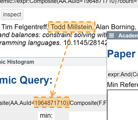
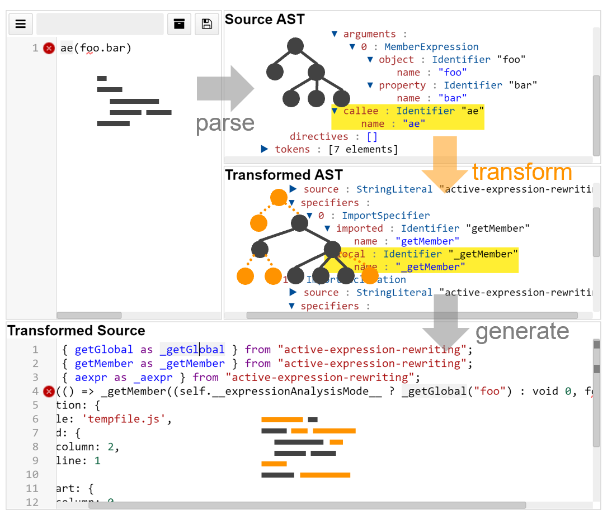

# PLCTE 2020 Seminar (HPI)

<lively-import src="../_navigation.html"></lively-import>

[topics](topics.md) 

<!--

-->

- Project 1: Stephan & Tobias (30+15): Smalltalk Shader Language  {.project}
- Project 2: Maximilian (20+10): Projecting Web Server Code  {.project}
- Project 3: Stefan & Josias (30+15): Polyglot Notebooks for VS Code  {.project}
- Project 4: Dominik (20+10): Immediate Test Feedback  {.project}
- Project 5: Paul & Joana (30+15): Examples as Tests  {.project}
- Project 6: Theo & Timon (30+15): Language-agnostic Live Programming Tools  {.project}
- [Project 7:   Leonard Pabst  *Drag-and-Drop UI for Microsoft Academic Queries *](project_07/index.md)  {.thumb} {.project}
- Project 8: Julian (20+10): Squeak OpenGL Canvas  {.project}
- [Project 9:   Tom Braun  *Debugging Source Code Transformations*](project_09/index.md)  {.thumb} {.project}
- [Project 10:   Jonas Grunert  *Interactive experimental Database Programming*](project_10/index.md)  {.thumb} {.project}

<lively-import src="../_logo.html"></lively-import>
<lively-import src="../_footer.html"></lively-import>