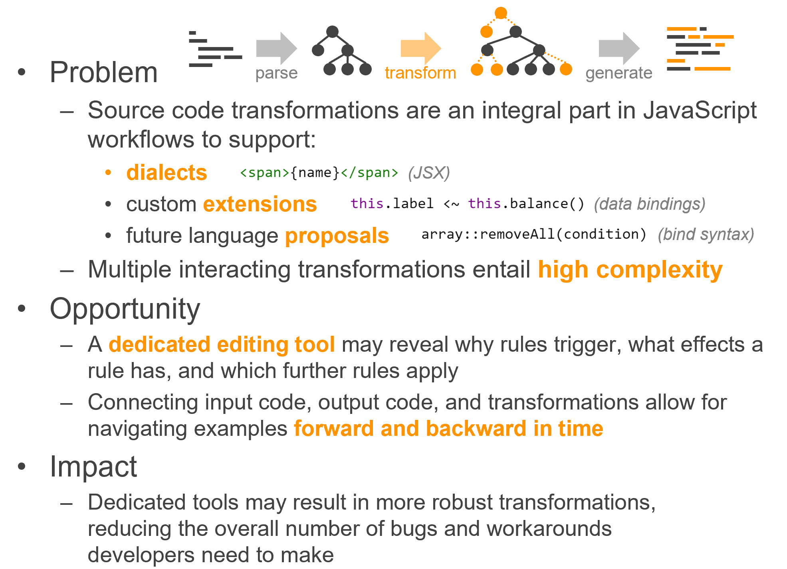
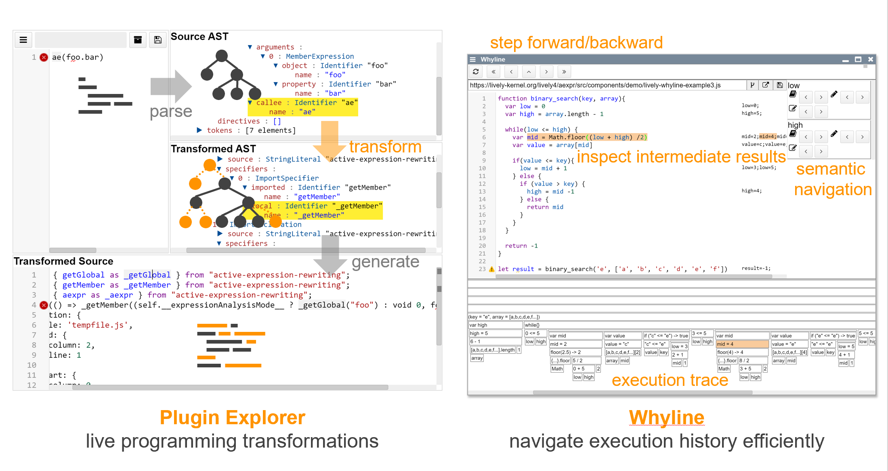

# Project 2: Tom Braun   *Debugging Source Code Transformations*

[**Paper**](Braun_2021_DebuggenVonQuelltexttransformationen_PLCTE20.pdf) | [**Slides**](Braun_2021_DebuggingAstTransformations_SLIDES.pdf)

<!--
- Problem
  - Source code transformations are an integral part in JavaScript workflows to support:
    - dialects
    - custom extensions
    - future language proposals
  - Multiple interacting transformations entail high complexity
- Opportunity
  - A dedicated editing tool may reveal why rules trigger, what effects a rule has, and which further rules apply
  - Connecting input code, output code, and transformations allow for navigating examples forward and backward in time
- Impact
  - Dedicated tools may result in more robust transformations, reducing the overall number of bugs and workarounds developers need to make
-->

