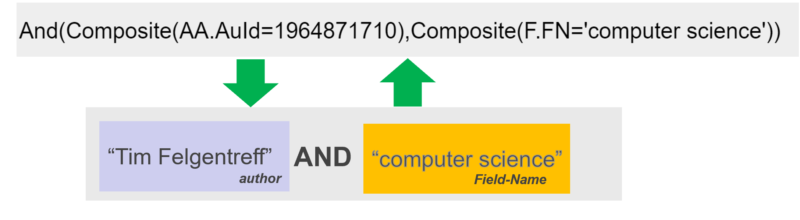

# Project 1: Leonard Pabst   Drag-and-Drop UI for Microsoft Academic Queries

[**google slides**](https://docs.google.com/presentation/d/1VMR78FqUW64xH4XG3bpXGq_s-vvx41TFfIG1GAx2WIk/edit#slide=id.p)

- Problem
  - Having a query language for Microsoft Academic is powerful
  - But textual query language can be tedious:
  - Typing *(or copy and pasting) with entity identifiers
  - Textual syntax like “And()” , “Composite()” and using sometimes quotes and sometimes not 
- Opportunity
  - Use a graphical block-based language allows to display author names instead of identifiers
  - Drag and drop fits into explorative UX
- Impact
  - Query based navigation becomes more explorative
  - Queries become readable and part of the UI

- Reading Tasks (to begin with)
  - [The Scratch Programming Language and Environment](https://dl.acm.org/doi/pdf/10.1145/1868358.1868363)
  - [Ten Things We’ve Learned from Blockly](https://developers.google.com/blockly/publications/papers/TenThingsWeveLearnedFromBlockly.pdf)
  - [Example Academic Query in Lively4 (use Chrome)](https://lively-kernel.org/lively4/lively4-core/start.html?load=academic://hist:Composite(AA.AuId=2154319088)?count=1000&attr=F.FN)
- Programming Tasks (to begin with)
  - Parse Microsoft Academic Queries
  - Create UI for nested Queries
  - Generate textual queries from UI

