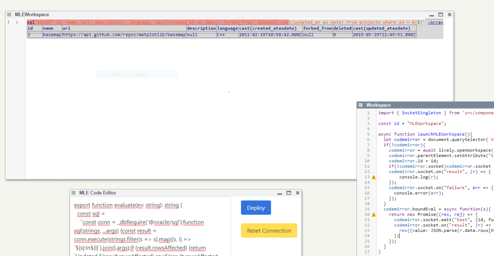

# Project 2: Jonas Grunert   *Interactive experimental Database Programming*
[**paper**](Grunert_2021_ExploratoryDatabaseProgrammingForOracleMle_PLCTE21.pdf) | [**slides**](Grunert_2021_ExploratoryDatabaseProgrammingForOracleMle_SLIDES.pdf)

{width=600}

- Enabling Exploratory Programming Workflow for Oracle Database Multilingual Engine (MLE) in Lively4

{width=600}
