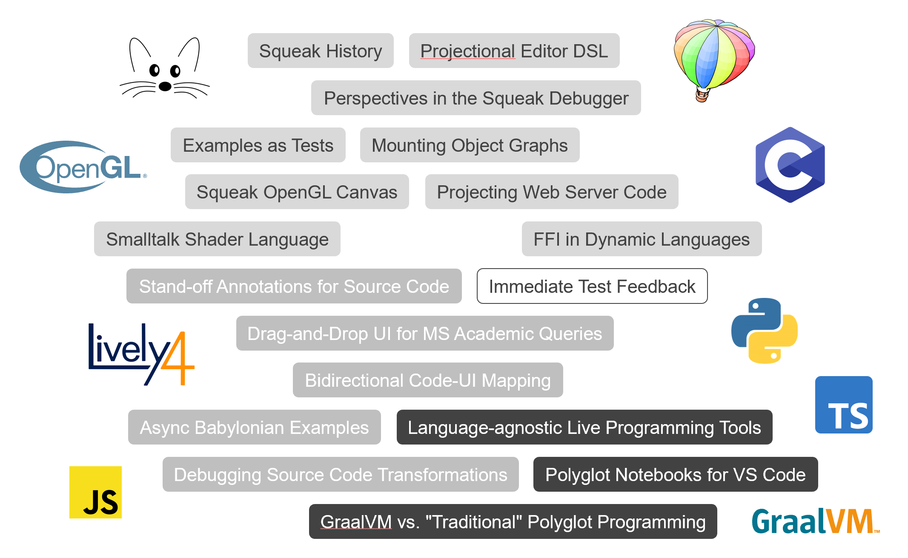
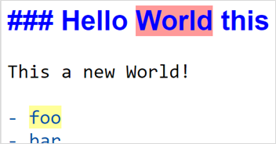
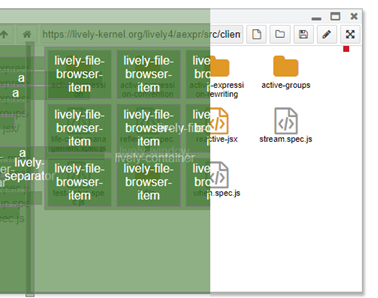
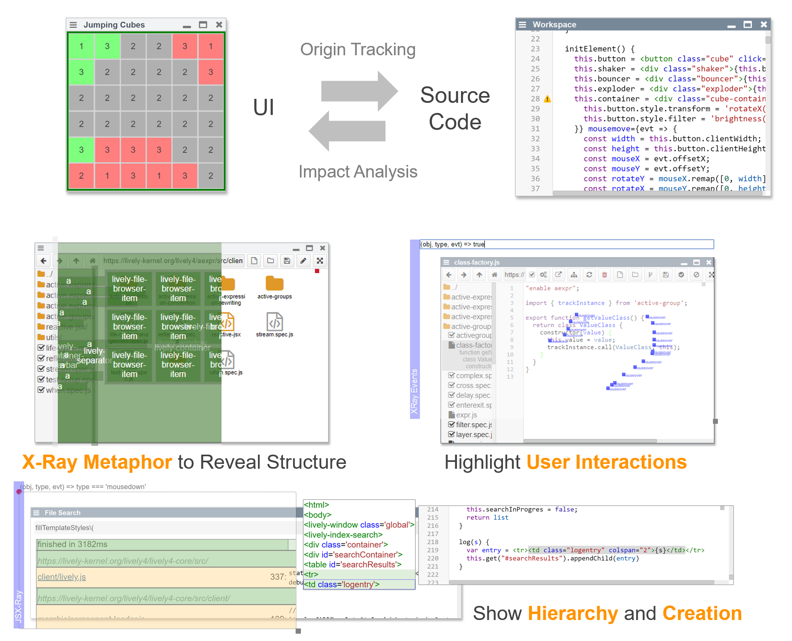
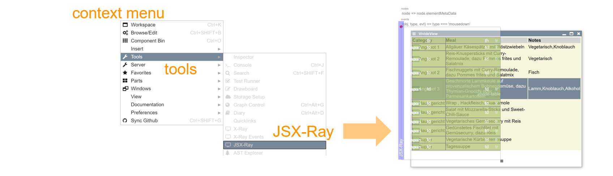

# Lively Related Open Topics

## Stand-off Annotations for Source Code

{style="float:right"}

- Problem
  - Embedded Annotations are language/context specific …
  - Generic standoff markup would become a powerful base-technology
  - Example: Generic Source Code Graffiti 
- Opportunity
  - Use Code Mirror tool support and diff-match-patch to keep annotations beside text
- Impact
  - Implementing Text/Source Code Augmentation such as Babylonian programming would become much easier
  - E.g. annotate source code with harvested type information or benchmark or code covering results 
- Reading Tasks
  - Overlapping_markup
  - Using SGML as a Basis for Data-Intensive Natural Language Processing
  - Annotations Example in Lively4
- Programming Tasks
  - Load Annotations Example in Lively4 and start annotating
  - … and break it

## Async Babylonian Examples in JavaScript 

- Problem
  - Babylonian Programming works fine for short and non async Examples in JavaScript
  - But especially in JavaScript UI network code is asynchronous
- Opportunity
  - Allow examples and trace async execution of code and update examples as when the promises resolve over time 
- Impact
  - Allowing to use the Babylonian Programming editor for longer running async examples will allow us to use it on the development of Lively4 itself
- Reading Tasks (to begin with)
  - Babylonian-style Programming: Design and Implementation of an Integration of Live Examples Into General-purpose Source Code
  - Zone-based Layer Activation: Context-specific Behavior Adaptations Across Logically-connected Asynchronous Operations.
  - Babylonian Demos in Lively4
- Programming Tasks
  - Get familiar with the Babylonian Programming Editor in Lively4
  - Write a simple example and then add code that waits..
  - Get familiar with instrumenting and tracing async code
  - Trace JavaScript Promises …. 
  - Combine both approaches

## Bidirectional Code-UI-Mapping 

{style="float:right"}

- Problem
  - Description of behavior in code and its effect are disconnected in time and space
  - The larger this gap, the harder a program is to comprehend
- Opportunity
  - Explicitly revealing this connection  facilitates program comprehension
  - An X-Ray tool may reveal the  underlying structure of an application  and map it back to source code
- Impact
  - Directly pointing to the source of an  effect may greatly reduce debugging effort
  - Similarly, writing programs may improve by directly pointing to the effect a piece of code has

- Reading Tasks (to begin with)
  - [Inventing on Principle](https://youtu.be/PUv66718DII?t=151)
  - [Babylonian-style Programming](https://www.hpi.uni-potsdam.de/hirschfeld/publications/media/RauchReinRamsonLinckeHirschfeld_2019_BabylonianStyleProgrammingDesignAndImplementationOfAGeneralPurposeEditorIntegratingLiveExamplesIntoSourceCode.pdf) + [Babylonian Demos in Lively4](https://lively-kernel.org/lively4/lively4-core/start.html?load=https://lively-kernel.org/lively4/lively4-core/src/babylonian-programming-editor/demos/index.md)
  - [Transmorphic](https://www.hpi.uni-potsdam.de/hirschfeld/publications/media/SchreiberKrahnIngallsHirschfeld_2017_TransmorphicMappingDirectManipulationToSourceCodeTransformations_HPI110.pdf)
  - Cuscus: An End User Programming Tool for Data Visualization in [End-User Development](https://link.springer.com/content/pdf/10.1007%2F978-3-030-24781-2.pdf)
  - The Gamma: Tools for open data-driven storytelling
- Programming Tasks (to begin with)
  - go to <https://lively-kernel.org/lively4/lively4-core/start.html>

