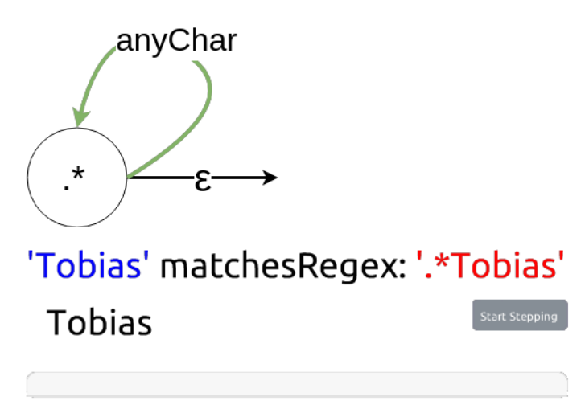

# PX 2018 Seminar

<lively-import src="../_navigation.html"></lively-import>

[**Topics**](topics.md)

<link rel="stylesheet" type="text/css" href="../seminars.css" />

- [Project 1:   Johannes Schneider, Julian Weise *Blockchain*](project_1/index.md)  {.thumb} {.project .lively4}
- [Project 2:  Sebastian Koall *Material Point Method*](project_2/index.md)  {.thumb} {.project .lively4}
- [Project 3:  Alexander Riese, Eva Krebs *Entity Component System*](project_3/index.md)  {.thumb} {.project .squeak}
- [Project 4:  Carl Julius Gödecken, Tom Beckmann *Create by abstracting*](project_4/index.md)  {.thumb} {.project .project .squeak}
- [Project 5:  Corinna Jaschek, Pascal Fuehrlich, Kim-Pascal Borchart *Regular Expressions*](project_5/index.md)  {.thumb} {.project .squeak}
- [Project 6:  Theresa Zobel, Siegfried Horschig *Graph Drawing*](project_6/index.md)  {.thumb} {.project .lively4}
 
  
<lively-import src="../_logo.html"></lively-import>
<lively-import src="../_footer.html"></lively-import>