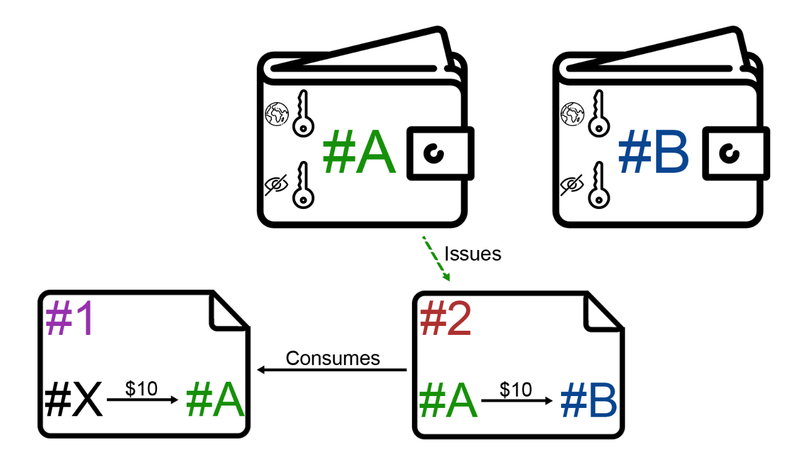

# Project 1: Johannes Schneider, Julian Weise   *Blockchain*

[**slides**](presentation.pdf)

- [essay/](essay/)
- [endterm-presentation/](endterm-presentation/presentation.md)
- [midterm-presentation/](midterm-presentation/)
- [activeEssay.md](activeEssay.md)
- [index.md](index.md)
- [notes.md](notes.md)
- [toDo.md](toDo.md)

der Commit-Hash unserer Abgabe lautet: ff40fb563ecee6dd66065c7686dca74a520134b1 bzw. 44851c7e459ada18510689478d4f94d2c068a2bb (merge branch) auf lively4-core.

Die Active Presentation findet ihr  unter: https://lively-kernel.org/lively4/lively4-core/start.html?load=https://lively-kernel.org/lively4/lively4-core/doc/PX2018/project_1/endterm-presentation/presentation.md

Den Screencast zur Demo findet ihr unter: https://lively-kernel.org/lively4/lively4-core/doc/PX2018/project_1/endterm-presentation/PX%20Screencast%20-%20Blockchain.mp4 (mit Audio-Kommentaren)

Die Implementierung der Blockchain findet ihr unter: https://lively-kernel.org/lively4/lively4-core/start.html?load=https://lively-kernel.org/lively4/lively4-core/src/blockchain/

Die Visualisierungen zur Blockchain findet ihr unter: https://lively-kernel.org/lively4/lively4-core/start.html?load=https://lively-kernel.org/lively4/lively4-core/templates/ (einfach nach Komponenten mit dem Prefix ‚blockchain‘ schauen)

## Screencast

<video controls width=640><source src="screencast.mp4" type="video/mp4"></video>