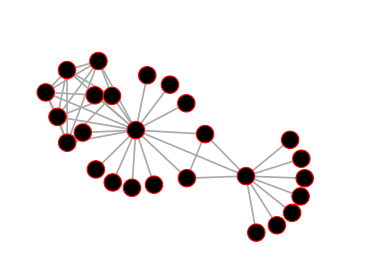

# Project 6: Theresa Zobel, Siegfried Horschig -- Graph Drawing {.title .lively4 .hpi}

<lively-import src="../_navigation.html"></lively-import>

<link rel="stylesheet" type="text/css" href="../../seminars.css" />

[**slides**](presentation.pdf)

## Screencast

- [screencast1_frocedirectedgraph](screencast1_frocedirectedgraph.mp4) {.video}
- [screencast2_simulatedannealing](screencast2_simulatedannealing.mp4) {.video}
- [screencast3_comparison](screencast3_comparison.mp4) {.video}

## Komponenten und JS-Files

### JS-Files

[annealing.js](annealing.js)
  - Beinhaltet das Simulated Annealing für Graphen, wird in den entsprechenden Komponenten eingebunden

[graphLoader.js](graphLoader.js)
  - Helper-Library zum Laden von Testgraphen und dem großen Lively-Module-Graph

### Komponenten

[lively-px18-force-layout](edit://templates/lively-px18-force-layout.html), [js](edit://templates/lively-px18-force-layout.js)
  - Komponente zur Präsentation vom d3-force-layout
  - Select oben erlaubt Auswahl des Graphen
  - Alpha-Bar zeigt die Simulationsaktivität, langsam sinkend nach erneutem Laden
  - Bedienelemente darunter erlauben Anpassung des Graphen/ der Simulation (MouseOver über Sliderelemente etc. gibt Zusatzinformationen)

[lively-px18-simulated-annealing](edit://templates/lively-px18-simulated-annealing.html) [js](edit://templates/lively-px18-simulated-annealing.js)
  - Komponente zur Präsentation vom Simulated Annealing
  - Select oben erlaubt Auswahl des Graphen
  - "Start Annealing"-Button startet die Simulation
  - "Current Energy" zeigt die Energie des derzeitigen Graphen
  - Bedienelemente darunter erlauben Anpassung der Simulation (MouseOver über Sliderelemente etc. gibt Zusatzinformationen)

[lively-px18-graph-drawing](edit://templates/lively-px18-graph-drawing.html) [js](edit://templates/lively-px18-graph-drawing.js)
  - Komponente zum Vergleich beider Layouts, Simulated Annealing (rechts) und d3-force-layout (links)
  - Select oben erlaubt Auswahl des Graphen
  - "Refresh Annealing" stößt erneutes annealing an bei dem rechten Graphen (linker bleibt unverändert)
  - Rechts oben steht die Energie des rechten Graphen
  

<lively-import src="../../_footer.html"></lively-import>