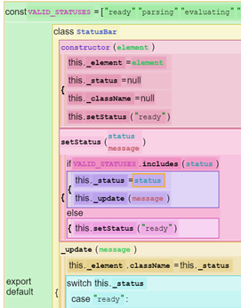
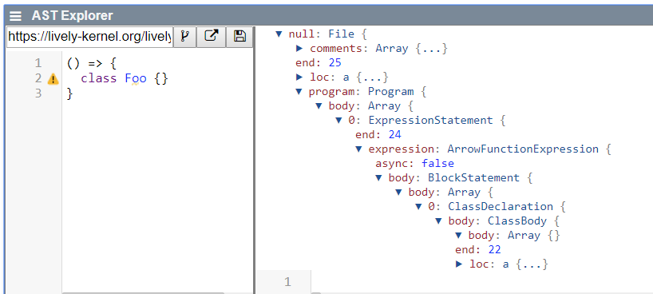
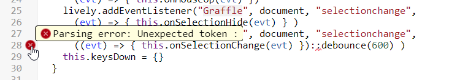
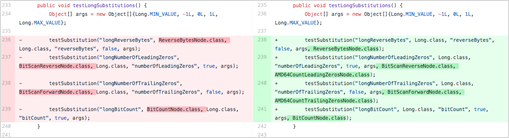
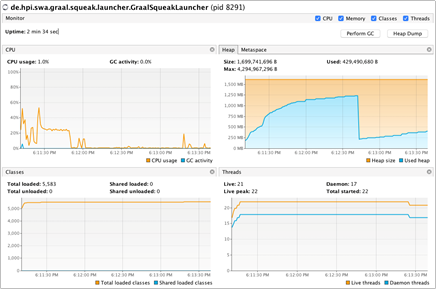
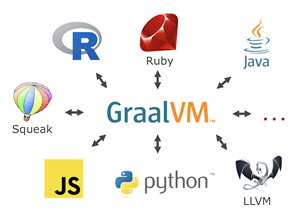
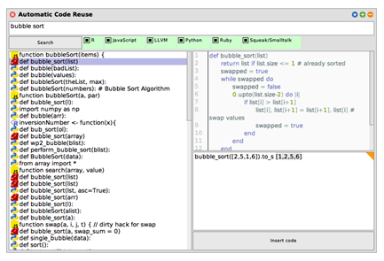

# PX 2019 Seminar (HPI)

<link rel="stylesheet" type="text/css" href="../seminars.css" />

<lively-import src="../_navigation.html"></lively-import>

[topics](topics.md)  [assignments](assignemtns.md)

- [Project 1:   Markus Brand, Merlin Haye, Florian Henschel *An AST-aware Textual Code Editor*](project_1/index.md)  {.thumb} {.project}
- [Project 2:   Wilhelm Friedemann, Stephan Lutz  *AST Explorer*](project_2/index.md) {.thumb}  {.project}
- [Project 3:   Ulrike Bath, Maximilian Goetz *Use Babel AST in ESLint*](project_3/index.md) {.thumb}  {.project}
- [Project 4:   Josias Uhlmann, Stefan Reschke *Polyglot Object Comparison Tool*](project_4/index.md) {.thumb}  {.project}
- [Project 5:   Teresa Lasarow, Kolya Opahle, Milan Proell *Virtual Machine Inspector*](project_5/index.md){.thumb}  {.project}
- [Project 6:   Jonas Grunert *MLE-Development Umgebung im Browser*](project_6/index.md) {.thumb}  {.project}
   
- [Project 7:   Jan Ehmueller,  Hendrik Tjabben *Polyglot Method Finder*](project_7/index.md) {.thumb}  {.project}

<lively-import src="../_logo.html"></lively-import>
<lively-import src="../_footer.html"></lively-import>