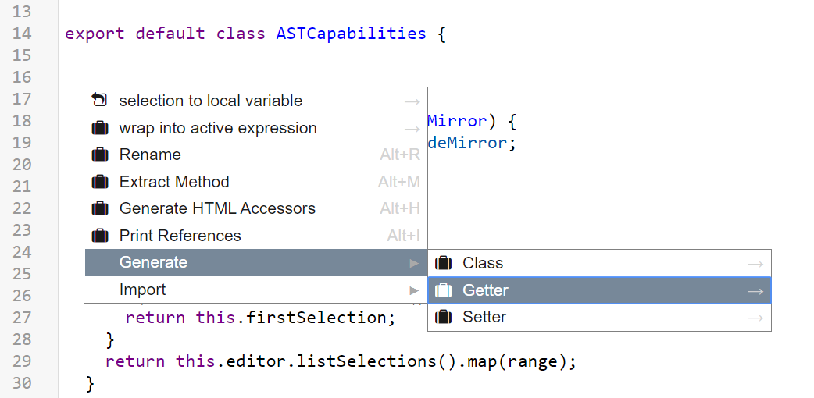
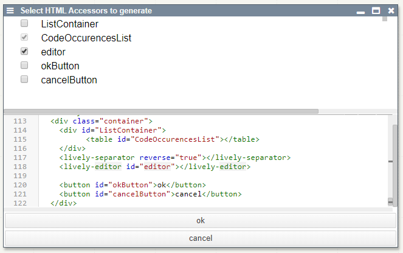
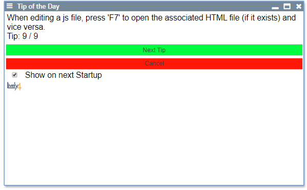

# Documentation

## Abstract

To make developing in lively faster for current users and more accessible for new users, we implemented functionality to conveniently generate standard code fragments, navigate through the code or refactor it. Providing these features in the right way to the user, either via context menu or via keyboard shortcut, was an important consideration during development: Straight forward concepts like the selection of code are usable via shortcuts, while more complex operations like the generation of a getter or an accessor to an HTML element can be reached through a context menu. For actions like the latter one, which require more input from the user (e.g. selection of wanted HTML elements), we also introduced a prototype for selection dialogs. After the generation of code, the user only needs to edit placeholders, which are selected automatically. We also implemented inline access to a color picker for intuitive color code generation as a proof of concept for code augmentation in general.

## Presentations

- [Midterm Presentation](https://docs.google.com/presentation/d/1KQEaM6kJoCLhnA3KnTdXFnuw1iJr766Umhl8CmEuhNk/edit#slide=id.p)

- [Final Presentation](https://docs.google.com/presentation/d/1af9Nq3_eZFsHx1w8yW4NA08VjB9Wgko_HZZSWZCbEKg/edit?usp=sharing)

## Features
### Code Navigation

| Shortcut              | Functionality           |
|-----------------------|-------------------------|
| Alt+Up                | Expand Selection        |
| Alt+Down        	    | Shrink Selection        |
| Alt+Left/Right        | Select previous/next Element |
| Alt+Right             | Select  Element         |
| Alt+J            	    | Go to definition        |
| Alt+Shift+Up/Down    	| Select previous/next like this |
| Alt+Shift+Left/Right 	| Select previous/next reference (cycle) |
| Alt-U/Alt-Shift-U	    | Undo/Redo Selection     |

### Code Refactoring

| Shortcut              | Functionality               |
|-----------------------|-----------------------------|
| Alt+R                 | Rename Identifier/Class Method |
|                       | (opens menu if identifier is used across files) |
| Alt+V             	  | Extract Variable            |
| Alt+M                 | Extract Method              |
|                       | (expands selection for ambiguous cases) |
| Alt+I                 | Print References            |
| Context Menu          | Wrap into active expression |

### Code Generation

| Shortcut              | Functionality               |
|-----------------------|-----------------------------|
| Alt+H                 | Generate Accessors from HTML|  	               
|                       | (existing getters are considered and displayed) |
| Context Menu          | Insert (at suitable location) |
|                       | * test case                 |
|                       | * class                     |
|                       | * getter / setter           |
| Context Menu          | Import                      |

### Code Augmentation

Color Picker
<input type="color" name="favcolor" value="#ff0000">

## Entry points

- [ASTCapabilities](browse://src/components/widgets/ast-capabilities.js)
  - collection of methods containing the logic for code editing, navigation and refactoring features based on AST functionality of the babel plugin

- [Codemirror Code Provider](browse://src/components/widgets/lively-code-mirror-code-provider.js)
  - facade between ASTCapabilities and edited code
  - provides interface for ASTCapabilities to access code, scrolling info, selections and cursor position

- [Context Menu](browse://src/components/widgets/lively-code-mirror-context-menu.js)
  - opened via "ALT + Enter"  
  
  
  

- [Occurrence Selection Menu](browse://src/components/widgets/lively-code-occurence-selection.js) [js + html]
   

- [Code Augmentation (Color Picker)](browse://src/components/widgets/lively-code-mirror-code-augmentations.js)
  - scans code for color value occurrences and adds bookmarks to edit them
  <input type="color" name="favcolor" value="#00ff00">

- [Tip of the day](browse://src/components/widgets/lively-code-tip.js) [js + html]
   

- [FileIndex](browse://src/client/fileindex.js)
  - added saving of identifiers as well as exported functions and classes per file

## Class Diagram

The URICodeProvider does not actually exist yet, but illustrates how other classes aside from the CodeMirror can use the ASTCapabilities.

## Future Work

### Next steps
- integrate AST functionalities into HTML and MD files (By creating a CodeProvider)
- inline variable declaration
- find other occurences after extracting code / literals and offer to replace them too
- update only edited part of code during AST operations (instead of replacing whole code) --> differential update (could use "replaceRange" of CodeMirror)
- additional code augmentation: e.g. parameter names in method calls, previews on hover, ...

### Other possible improvements
- generate more code constructs: e.g. if block, method skeleton, loops, ... (maybe integrate into auto-completion)
- add state/history to navigation: select previously selected parts when reducing a selection
- extend extract method functionality: e.g. handle multiple returns in extracted code
- further improve context awareness of code generation: i.e. generate at next suitable location
- code navigation via mouse input: e.g. Ctrl + Left Mouse click on identifier to jump to definition 

### Possible new features
- change method signature: convenient editing of method signatures (e.g. name, modifiers, parameters, ...) for example via dialog
- sort code: sorting of semantic code sections (e.g. parameter lists, imports, methods of markdown categories, ...)
- automatic code improvement suggestions: e.g. "make method static", "invert if condition", ...
- inverse code folding
- integrate livescript like projectional editing ideas: e.g. code shortening (todos.map(.done) instead of todos.map((todo) => todo.done))