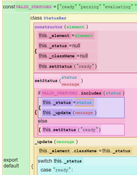

# Project 1:   Markus Brand, Merlin Haye, Florian Henschel *An AST-aware Textual Code Editor*

Projectional Editors have advantages compared to traditional text-based editors, BUT: 
- 1. Implementing and optimizing an AST-Editor requires huge amount of effort 
- 2. Fully functional AST-Editor feels odd and unfamiliar for programmers

**Goal**: Apply benefits of AST-awareness onto standard text editor (Code Mirror) 
- [AST-aware code navigation](CodeNavigation.md) 
- Structure-aware code completions (insert test case, …) 
- Inverse code folding 
- [Refactoring tools](Refactoring.md) 

Important Components:
- LivelyCodeMirror: [open](open://lively-code-mirror), [browse](browse://src/components/widgets/lively-code-mirror.js)
- LivelyCodeMirrorASTCapabilities: [browse](browse://src/components/widgets/lively-code-mirror-ast-capabilities.js)

