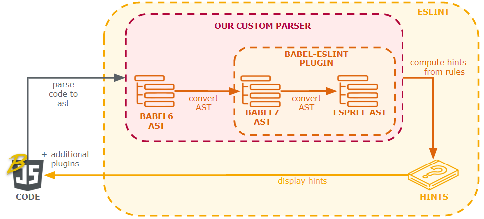

# Documentation

## Abstract

The ESLint's default parser only supports the latest final ECMAScript standard and does not support experimental (such as new features) syntax provided by Babel. These features are used in several Lively4 files. You would encounter problems, where code with unknown syntax could not be parsed by the default ESLint parser, resulting in not displaying any lint-errors at all. Unfortunately, especially in longer files the linting is impossible as soon as it contains at least one unknown syntax.

For validating, the code has to be parsed into an Abstract Syntax Tree (AST). It currently fails at this stage due to the unkown syntax problem. Babel uses an AST-parser as well to compile the code to ES6 Javascript. Hence, Lively4 already has a way to parse a correct AST from code including the new syntax.

The Babel parser creates a Babylon-AST, while for ESLint an Espree-AST is needed. So our task concluded in finding a way to transform the Babylon-AST into a correct Espree-AST and handing this new one into ES-lint. There exists a NodeJS-based project which solves this problem of converting a Babylon-AST into an Espree-AST. 

Therefore, we used this project as our starting point and had to modify it so it fits our needs. The current Babel version (6.23) is not supported in this project and it could not run in browser since it was written using CommonJS. We separated the Babel dependencies from the project, so we could pass in the necessary Babel functionality from Lively4 at runtime. Additionally, we wrote an adapter to convert the Babylon-AST based on an unsupported Babel version to the latest version. Eventually, we browserified the project. We decided to manually change the problematic code and upload the files instead of uploading a broswerified bundle. This way, our custom parser can be easily debugged and adapted in case it is not working correctly. 

Lastly, ESLint offers the functionality to define a custom parser at runtime where we hand over our new parser. In Component Overview one can see the final structure of our custom parser which supports a Babylon-AST based on Babel 6. As far as we can tell, ESLint works correctly for large files without any additional massive loading time.

[PX-Eslint Github Repository](https://github.com/MPGoetz/PX-EsLint)

## Result
<video width="720" height="480" controls>
  <source src="eslint-screencast.mp4" type="video/mp4">
Your browser does not support the video tag.
</video>

## Component Overview

## Entry points

- [eslint-parser](browse://src/external/eslint/eslint-parser.js)
  - our custom parser which is passed to ESLint

- [babylon-to-espree](browse://src/external/eslint/babylon-to-espree7.js)
  - plugin with modifications used for the ast transformation

- [eslint-lint](browse://src/external/eslint/eslint-lint.js)
  - configurations for the linter, there you can define the custom parser

## Sources

### Related Work
- [babel-eslint](https://github.com/babel/babel-eslint)
  - NodeJS Plugin of a Babel Parser for ESLint

### Interfaces for the ASTs
- [Babylon6](https://github.com/babel/babylon)
- [Babylon7 with Estree](https://github.com/estree/estree)