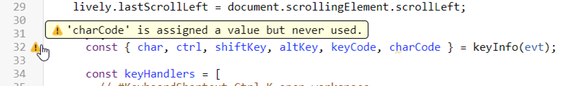
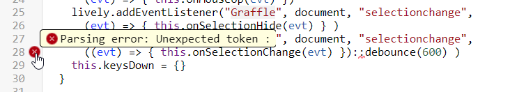

# Project 3:   Ulrike Bath, Maximilian Goetz *Use Babel AST in ESLint*

ESLint Example:

Problem: Uses its own Parser, which does not know about Babel Syntax/Language extensions

**Goal:** Make it compatible with our “JavaScript”

