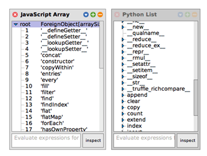

# Project 4:   Josias Uhlmann, Stefan Reschke *Polyglot Object Comparison Tool*

- Interactively explore, compare, and diff interfaces of objects from different languages

- Motivation: 
  - Objects from different languages may represent same concept (e.g. List, DateFrame, …), but have slightly different interfaces (e.g. R data.frame vs. Pandas DataFrame)

