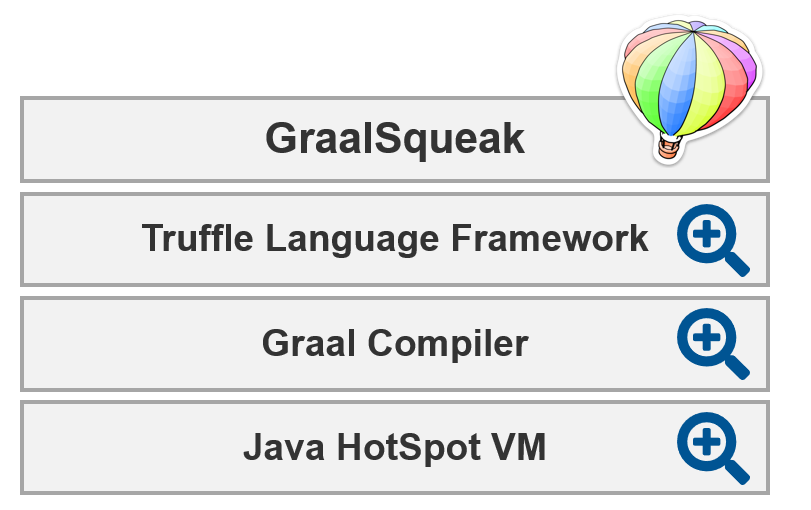

# Project 5:   Teresa Lasarow, Kolya Opahle, Milan Proell *Virtual Machine Inspector*

- Visualize and exploit information from underlying runtime components
  - E.g. JIT-compiler, garbage collector, object model, …
- Improved code completion based on profiling data already collected on the VM level
- Visualize “hot” methods

{height=200}
