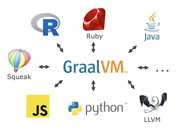

# Project 6:   Jonas Grunert *MLE-Development Umgebung im Browser*

Main Ideas:  
Using websockets to communicate efficiently iwth the server:  
  Libraries which may be used:  
    1. **[socket.io](https://socket.io/)** will be used because of ease and distribution of framework
    2. sockjs - [node](https://github.com/sockjs/sockjs-node) and [browser](https://github.com/sockjs/sockjs-client)  
    3. [primus](https://github.com/primus/primus)  
Using many different widgets:  
  Required:  
    1. Code Editor  
    2. Result Presenter  
    3. Table Presenter  
    4. SQL Editor  
  Additional:  
    5. Test Case Editor  
    6. Database Inspector  
    7. Generated Code Shower  
  Not in Scope:  
    8. Database Explorer  
    9. Stacktrace  
    10. AST Explorer
    
    
Widget Blueprints:  
Table Presenter:  
let data = [[1, 'Bond', 'James Bond'],[2, 'Alex', 'Just Alex']]  

