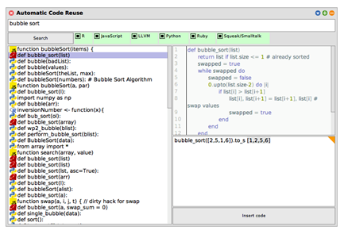

# Project 7:   Jan Ehmueller,  Hendrik Tjabben *Polyglot Method Finder*

- Help developer choose the “right” code
  - Depending on performance, maintainability, …?
  - How much can be automated?
- Tool to compare code/algorithms written in multiple languages based on user input

