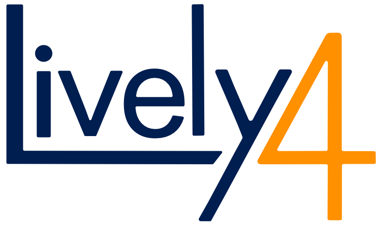

<!-- markdown-config presentation=true -->

<!-- #TODO make style links in container content relative to url -->
<!-- <link rel="stylesheet" type="text/css" href="style.css" /> -->
<link rel="stylesheet" type="text/css" href="./style.css"  />
<link rel="stylesheet" type="text/css" href="https://lively-kernel.org/lively4/lively4-core/src/client/lively.css"  />
<link rel="stylesheet" type="text/css" href="https://lively-kernel.org/lively4/lively4-core/templates/livelystyle.css"  />

<!--

-->

  PX 2018: Seminar on Programming Experience

  Jens Lincke, Stefan Ramson, Patrick Rein, Marcel Taeumel, Robert Hirschfeld

  Software Architecture Group  Hasso Plattner Institute  University of Potsdam, Germany

--- 

# Abstract

<!-- #TODO get rid of this formatting #Hack -->

 

[Active Essays](http://www.playfulinvention.com/emergence/active-essay.html) and [Explorable Explanations](http://explorabl.es/) are a form of interactive media that can help understand complex systems for many relevant domains.
In particular, the domain of software design is filled with challenging algorithms, patterns, and systems that are hard to understand and master. 
In this seminar, the participants will create demos, tools, and applications based on the idea of Explorable Explanations to improve the programming experience when developing such systems.
By using our live collaborative development environment, [Lively4](https://lively-kernel.org/lively4/lively4-core/start.html), they will share, explore, and adapt the created tools and explanations --- even in unanticipated ways.

---

<!-- #SWD12 -->
# What will this Seminar be about?

- Design ideas
  - Algorithms 
  - Patterns

- Found in all kinds of software systems 
  - Programming languages
  - Frameworks 
  - Libraries
  - Applications

---

# How to present the idea

- Implement the idea in a new environment / language
- Generate visualizations and animations 
- Goal: make the idea better understandable

---

# Examples

- [A* vs Dijstra Path Finding Algorithms](https://www.redblobgames.com/pathfinding/a-star/introduction.html)
- [Explorable Explanations](http://explorabl.es/) 

---

# Implementation Platforms

<table style="margin-left: 10px; margin-top: 100px; text-align: center; font-size: 20pt;" > 
  <tr >
    <td width="40%"></td>
    <td width="40%"></td>
  </tr>
  <tr>
    <td><a href="http://squeak.org">Squeak (Smalltalk)</a></td>
    <td><a href="https://lively-kernel.org/lively4/lively4-core/start.html">Lively4</a>: JavaScript, Web components</td>
  </tr>
</table>

---
# Topics

<!-- #Idea make TOC navigate-able? Goto slide? -->

--- 

# Topic Draft

- One AST to rule Them all:
  - Topic: Replace Tern
    - Use Case: Jump to definition 
  - Topic: AST Explorer
    - current AST explorer is inspector on minified AST.... names/types are compiled away.... change this
  - Topic: Use Babel AST in ESLint   
  - Topic: Projectional Text Editing, augment Text Editor with Projectional Editing Capabilities @onsetsu 
- X Ray
  - Topic: X Ray traces behavior
    - Fast Lightweight Tracing
  - Topic: Explosion View / Better Label Placement
  - Topic: Show Async Behavior / Net Requests
  - Topic: Mapping Classes / Methods / Functions to Files
- Polyglot Programming
- Babylonian Programming
  - Babylonian Programming in Python

<!---
---
# Topic 01: Graph Drawing

- Domain: Visualization algorithms
- Compare:
  - Simulated Annealing
  - Force Layout
  
</img>

- Literature
  - [wikipedia:Graph Drawing](https://en.wikipedia.org/wiki/Graph_drawing)
  - Ron Davidson, David Harel (1996). Drawing graphs nicely using simulated annealing
  - Thomas M. J., Fruchterman  Edward M. Reingold (1991). Graph drawing by force-directed placement
-->

---
# And ...

Propose your own topic!

---

# Form of Presentation 

- Demo / active content with text (no external slides)
- Squeak: see BookMorph etc
- Lively4: Markdown / HTML  

---

# Content of Presentation

- Present and explain problem and specific solution of the domain problem
- Use interactivity and visualizations that are supported by text 
- Present your solution on a meta level: present how you visualized made it interactive

---

# Early Feedback Presentation

- No weekly meetings, but we want to know if you are on the right track
- Solution, one very short presentation:
  - Understanding the problem / motivation?
  - Handle technical problems with both domain and presentation technogy?
  - Are on the right track?
- Max 10 mins 
  
---
# Schedule

- Project presentation (April 11th)
- Topic assignment and Tutorial(s) (April 18th) 
- Continuous consulations (in C.E)
- Early feedback presentation (10min), May 16th
- Continuous consulations (in C.E)
- Presentations (30min + discussion), 2 projects per session until July 18th

---

# Organization

- Project-Seminar, 4 SWS, 2 students per group
- Grading 
  - 6 ECTS graded credit points
  - Grade based on project and presentation
- Hand-In
  - Presentation, Screencast, Sourcecode
- Enrollment with preferred 3 topic names on or before April 16th
  - Mail to stefan.ramson@hpi.de and jens.lincke@hpi.de with PX2018 in subject
- Presentation dates determined after topics are assigned

---

<!-- #TODO pull this up into presentation? -->

