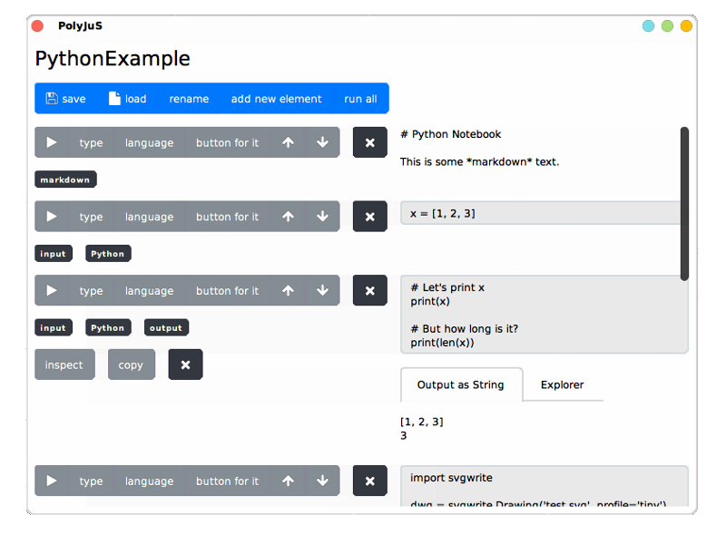
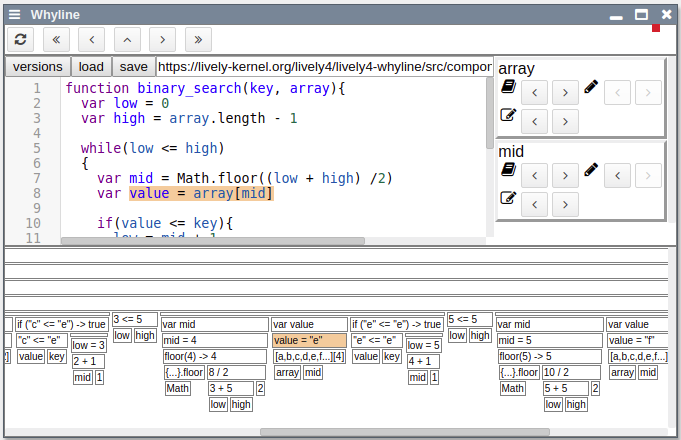
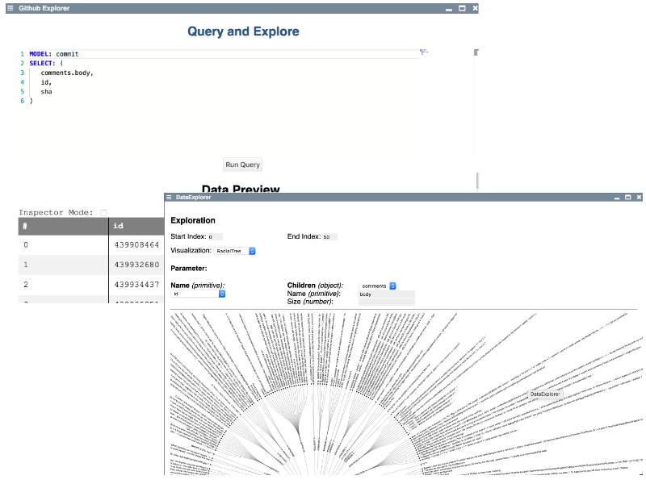

# RE 2018 - Reverse Engineering Seminar (HPI)

<lively-import src="../_navigation.html"></lively-import>
<link rel="stylesheet" type="text/css" href="../seminars.css" />

[**description**](description.md) [**topics**](RE18_Topics.pdf) [**assignments**](assignments.md)

## Projects

- [Project 1: Eva Krebs, Christian Flach - Jupyter Notebooks in Squeak/Smalltalk](project_1/index.md)    {.thumb} {.project}
- [Project 2: Florian Henschel, Erik Brendel - Categorizing Message Categories](project_2/index.md)    {.thumb} {.project}
- [Project 3: Stephan Lutz, Martin Stamm - Why and Why Not Questions](project_3/index.md)    {.thumb} {.project}
- [Project 4: Marcus Konrad, Martin Fischer - Stroposcoping for non-graphical Objects](project_4/index.md)    {.thumb} {.project}
- [Project 5: Friedrich Schoene,  Victor Künstler - Github-Explorer ](project_5/index.md)    {.thumb} {.project}
- [Project 6: Noel Danz, Raoul Baron - Recovering Data](project_6/index.md)    {.thumb} {.project}
- [Project 7: Jonas Beyer - The Program according to Garp](project_7/index.md)    {.thumb} {.project}
- [Project 8: Falco Duersch - SSL Support in GraalSqueak](project_8/index.md)    {.thumb} {.project}
- [Project 9: Melanie Schneider - Lively4 Semantic Code Overview](project_9/index.md)    {.thumb} {.project}

## Development Links

- RE2018 @ https://github.com/LivelyKernel/lively4-seminars/ 
- edit it as [Lively4MarkdownWiki](https://lively-kernel.org/lively4/lively4-core/start.html?load=https://lively-kernel.org/lively4/lively4-seminars/RE2018/)

{width=80px}  
  - [https://squeak.org/](https://squeak.org/)
  - [https://github.com/hpi-swa/vivide](https://github.com/hpi-swa/vivide)

  - [https://github.com/livelykernel/lively4-core](https://github.com/livelykernel/lively4-core)
  - [https://lively-kernel.org/lively4/lively4-core/start.html](https://lively-kernel.org/lively4/lively4-core/start.html)

## Material

- "Software reverse engineering can help to improve the understanding of the underlying source code for the maintenance and improvement of the software, relevant information can be extracted in order to make a decision for software development and graphical representations of the code can provide alternate views regarding the source code, which can help to detect and fix a software bug or vulnerability." [wikipedia](https://en.wikipedia.org/wiki/Reverse_engineering)

- Reverse Engineering: "the process of analyzing a subject system to identify the system's components and their interrelationships and to create representations of the system in another form or at a higher level of abstraction" IEEE in [wikipedia](https://en.wikipedia.org/wiki/Reverse_engineering)

Understanding and enhancing existing software systems can be hard, especially when the subject system is legacy software or a still prototype and good documentation, architecture and software design are missing or not yet there. 

Reverse engineering is a process of analyzing such systems, by identifying its components and their interrelationships, and create representations of the system in another form or at a higher level of abstraction (see [1]), that help refactoring and evolving such systems.  

In this seminar, the participants will work in teams to develop reverse engineering tools in the context of exploratory development environments Squeak (Smalltalk) and Lively4 (JavaScript) that facilitate such a process. 

[1] Chikofsky, E. J.; Cross, J. H. (January 1990). "Reverse engineering and design recovery: A taxonomy". IEEE Software. 7: 13–17. doi:10.1109/52.43044.

<lively-import src="../_logo.html"></lively-import>
<lively-import src="../_footer.html"></lively-import>