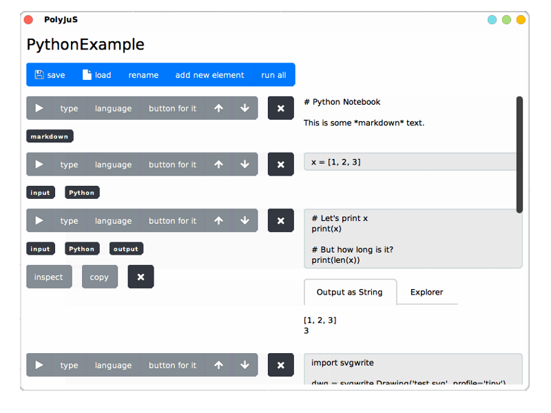

# Project 1: Eva Krebs, Christian Flach - Jupyter Notebooks in Squeak/Smalltalk

The PolyJuS project aims to combine Jupyter notebooks and Polyglot in Graalsqueak.
The tool allows the creation of PolyJuS notebooks.
The notebooks can be saved to and loaded from the pre-existing ipynb-format.
Like Jupyter, notebooks can consist of several code and text cells.
Unlike Jupyter, each code cell may have different programming language that is supported by Polyglot.
Using a special "bindings" object, other objects may be shared between languages.
Outputs can be viewed and explored in several ways in the Smalltalk environment.

## Screencast

<video width=480 controls><source src="screencast.mp4" type="video/mp4"></video>

## Project Description

- Notebooks in Squeak/Smalltalk
  - Load and save (export) notebook files
  - Notebook UI, support for object inspector and charts, …
- Experiment with multi-language support in notebooks (Smalltalk, Ruby, Python, JavaScript, LLVM, …)

