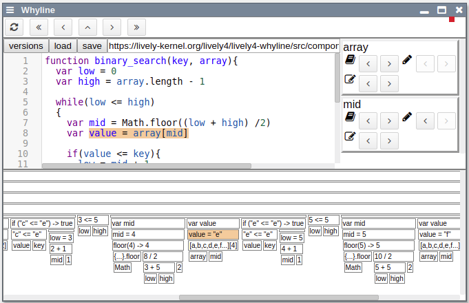

# Lively Whyline
The Lively Whyline is an implementation of the [Whyline Concept by Andrew Ko](http://faculty.washington.edu/ajko/papers/Ko2008Dissertation.pdf) for JavaScript. It aims to make debugging easier by asking causal questions about how the code executed.

## Motivation
Debugging is difficult. A visible failure is often only a single part of a whole chain of errors whose ultimate cause might seem deceptively unrelated to the obvious problem. Finding the real defect thus requires programmers to follow a chain of faulty state and control flow backwards to its root.

Classic breakpoint debuggers, however, typically only allow programmers to move forwards through the execution. Following the error propagation chain backwards therefore requires the repeated use of breakpoints and logging statements at suspected problem areas. This process is not only inefficient but also prone to errors, since the derivation of state and control flow dependencies has to be done through mental simulation and educated guesses.

To take these burdens off of the programmer, the Lively Whyline employs a post-mortem approach to debugging. Not only can every part of the execution be inspected without any temporal restrictions, but the Whyline also provides tools to follow data and control flow dependencies, effectively reducing programmers' search space when investigating the root cause of failures.

## An Example
A screencast with some of the basic functionality implemented can be found [here](screencast-whyline.mp4).
## Features

#### Javascript Tracing
Many of the Javascript language's elements ([ES2018](http://ecma-international.org/ecma-262/)) are traceable on an AST node level. We provide a list of missing lanugage features and issues we know of down below. Everything else we probably just haven't seen break yet.
#### Trace View
Beneath the code mirror, a tree view of the last execution is displayed. It provides an overview of the control flow of the program. Nodes can be selected by clicking them. 
#### Code navigation
The execution trace can be navigated using the buttons above the code mirror:
- `<` / `>` goes one step backward / forward
- `<<` / `>>` finds the previous / next occurence of the selected ast node
- `^` moves up in the control flow chain (loops, functions, if-statements, etc.). 
#### Following Data Flow
On the right hand side a column of data flow questions can be found. These questions change dynamically depending on the variables relevant to the selected node.

## Code Structure
`lively-whyline.[js/html]` _Graphical tool._  
`lively-whyline-plugin.js` _Plugin for [babeljs](https://babeljs.io/). Transforms code to include tracing statements, so that the execution of the transformed code creates an execution trace._  
`lively-whyline-tracing.js` _Defines the structure of and operations available on an execution trace as well as the individual trace nodes._  
`lively-whyline-example.js` _Showcase of most of the covered language features._  
`lively-whyline-example2.js` _Code with a defect ([source](https://eloquentjavascript.net/08_error.html))._  
`lively-whyline-example3.js` _A binary search algorithm._  

## Issues
### Destructuring
To determine the value of variables and properties after a destructuring assignment, the tracing adds an expression after the assignment accessing the relevant variables and properties. If a property accessor with side effects is used, however, the program might behave differently.

### Function Scopes
To track the identity of variables we elected to attach a represantative for each variable to the trace node of its scope. Whenever an operation on this variable is to be logged, this representative has to be found - usually by looking up parent chain. The scope of functions, however, do not depend on an ancestor, but the scope they were defined in. Since we do not yet trace any object's or even any function's history, we currently opted to incorrectly also go up the parent chain for functions. This may be a drawback of our implementation, though it won't really matter in the long run, once object histories are actually traced.

### Missing Language Features
- scopes
  - trace binding of `this`
  - `var` variables' scopes are not set correctly (as they don't attach to the directly enclosing scope but rather the closest function block)
- UpdateExpression
  - don't assume all arguments are identifiers
  - read result value again afterwards (currently doesn't jell with post-updates like `i++`)
- ForInStatement / ForOfStatement
  - track declared variables
- declarations
  - FunctionDeclaration
  - ObjectMethod
  - ClassDeclaration + ClassMethod
- completion statements
  - BreakStatement
  - ContinueStatement
  - LabeledStatement
- error handling
  - TryStatement
  - CatchClause
  - ThrowStatement
- generator functions
  - **How to represent them visually in our trace view?**
  - YieldStatement
- SwitchStatement
- WithStatement
- TemplateLiteral
  - can have children (expressions)
- JSXElement

## Ideas
- reconstructable scopes
  - display all variables and their values at the point of executing the selected node
  - highlight shadowed variables
- loop iterations
  - group iterations into nodes
  - filter "all iterations where code X was executed"
- object history
  - log where an object was created
  - log changes to object properties over time
  - log all nodes that have touched an object
- [d3js trace view](trace-view-design/README.md)
- object inspector
  - integrate some form of object inspector into the UI
  - in combination with object history: allow questions about properties
- astNode occurrences
  - values over time
  - dynamically map & filter values
- cross-module tracing
  * (Babylonian Editor already does something similar?)
  - follow import statements and trace their sources
- linting the program execution
  - was a property accessed before it was assigned?
  - does a function have side effects?
    - does a function have no side effects but does not return?
  - were parts of the code never reached?
  - demeter's law?

### User Interface
- [nested nodes](trace-view-design/README.md)
- basic navigating functions
  - first/last node in function
- collapsing trace nodes
- zooming in on nodes (double click)
- "X-Ray" code (when node selected)
  - replace code with concrete values
  - hoverables for more complex objects
- color schemes for nodes
  - based on node type (statement, expression, return, function)
  - based on selected node
    - backward & forward slice
    - other occurrences
    - other nodes in the same scope
- hovering question button shows answer (e.g. code / node highlighting)
