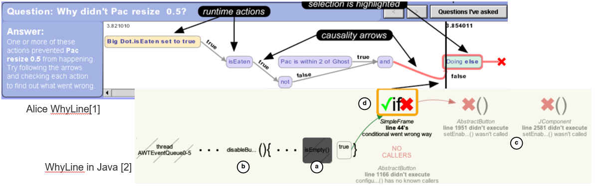
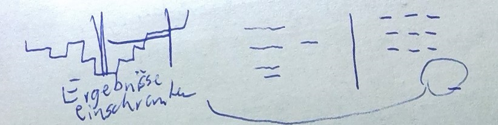
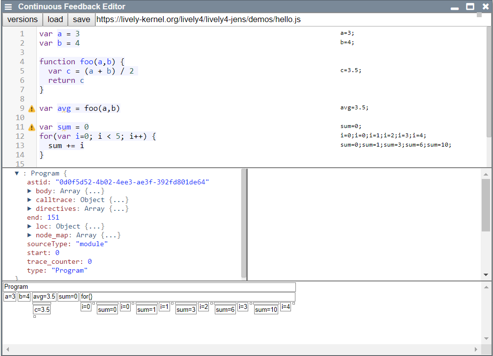

# Project 3: Stephan Lutz, Martin Stamm - Why and Why Not Questions

## Description

- Identifying the root cause of a failure involves an enormous search space, often sifted through manually
- The WhyLine automates this process, by allowing programmers to ask why and why not questions about a program's execution 
- *Goal:* Implement a [WhyLine](https://github.com/andyjko/whyline) for JavaScript

---

## Readings

- Whyline
  - Papers attached, but search for Ko's Thesis
- Static Analysis with Program Slicing (Andreas Zeller: Why Programs Fail?)
- Dynamic Analysis

### Frameworks

- Babel:
  - Das [Babel Handbook](https://github.com/jamiebuilds/babel-handbook/blob/master/translations/en/plugin-handbook.md) liefert euch einen Einstieg in viele Traversierungs- und Manipulationsmethoden für Babel.
  - [Hier](https://github.com/babel/babylon/blob/master/ast/spec.md#memberexpression) sind alle Typen von AST-Knoten in JavaScript aufgelistet, zusammen mit den Parametern, die sie zur Erstellung erwarten.
- Die [CodeMirror website](https://codemirror.net/doc/manual.html) liefert generell eine äußerst gute Dokumentation, ebenfalls mit vielen Beispielen.
- Visualisierungen in d3 (falls ihr so was machen wollt) läuft bei vielen beispielgetrieben ab, also einfach ein passendes [Beispiel](https://github.com/d3/d3/wiki/gallery) raussuchen, kopieren und tweaken bis es eure Daten frisst.
- In lively benutzen wir zur statischen Code-Analyse Tern. evtl können wir den zur weiteren Analyse für Program Slices verwenden (ist aber fraglich), einen älteren aber sehr verständlichen Artikel zu Tren gibts [hier](http://marijnhaverbeke.nl/blog/tern.html).

## Project Scope

- Programmanalyse
  - Statisch
  - Dynamisch
- Toolintegration
  - auch: Interaktionsdesign
    

## Initial Tasks

- [x] Readings durchgehen, weiterführende Literatur suchen
- [ ] Kopie des ContinuousEditors (als Spielwiese) anlegen

---

