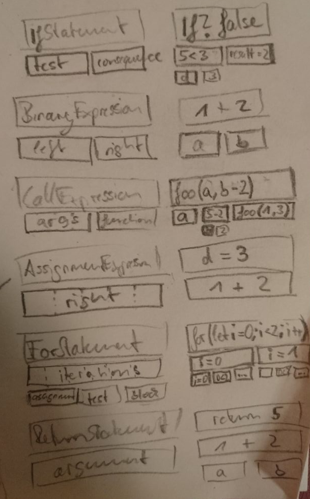
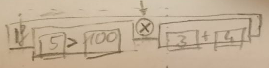
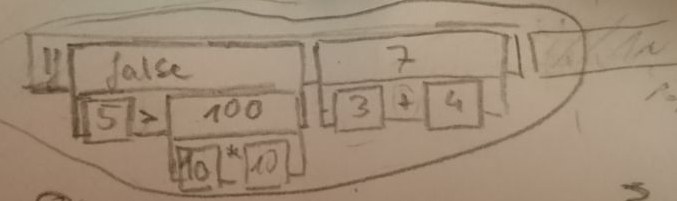

# Designing the Trace View
## Layouting
### Node Width
1. width proportional to total width required
2. static width (all children equal / set proportions per child)
3. always total width required

## Graph Structure
### Strict Icicle
- relatively easy to implement (already is implemented)
- every node has space to describe itself
  - some nodes, however, just don't have any information to add
- relation between parents and their children is not visible with a glance

### Nested
- does not convey any information about sub-expression's value

### Nested with Double-decker Expressions
- expressions have 2 rows: value & behavior
- enriches the nested design (which much better visualizes the relation between parents and their children) with the benefit of concrete values
- leaves the possibility open for turning off the value row to dramatically reduce the vertical size of the trace view
- having a graphical representation of an expression's value makes it easier to visually reference / highlight it

