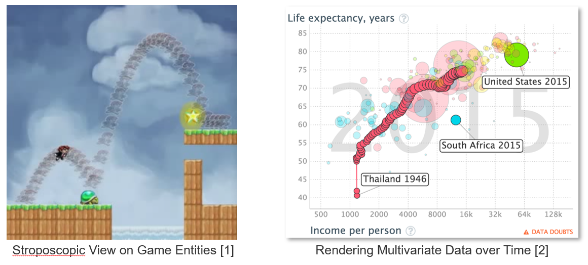

# Project 4: Marcus Konrad, Martin Fischer - Stroposcoping for non-graphical Objects

## Description

- Stroposcopic views allow to comprehend the *over-time behavior* of objects, but are *limited to graphical objects*
- Challenge: Arbitrary objects are n-dimensional data points
- Hypothesis: Only few properties of an object change frequently
- **Goal:** Provide a stroposcopic view for arbitrary JavaScript objects

---

## Readings

- Bret Victor: Inventing on Principle (https://youtu.be/PUv66718DII?t=642)
- Lienhard, Adrian, Stéphane Ducasse, and Tudor Gîrba. *Object flow analysis: taking an object-centric view on dynamic analysis.* Proceedings of the 2007 international conference on Dynamic languages: in conjunction with the 15th International Smalltalk Joint Conference 2007. ACM, 2007.
- Vasily Kirilichev, Eric Seckler, Benjamin Siegmund, Michael Perscheid, and Robert Hirschfeld. *Stepwise Back-in-time Debugging*. In Proceedings of GI Informatiktage 2014, Potsdam, Germany, March 27-28, 2014, GI.

## Project Scope

- ...

## First Steps

- [Gapminder](https://www.gapminder.org/) ausprobieren
