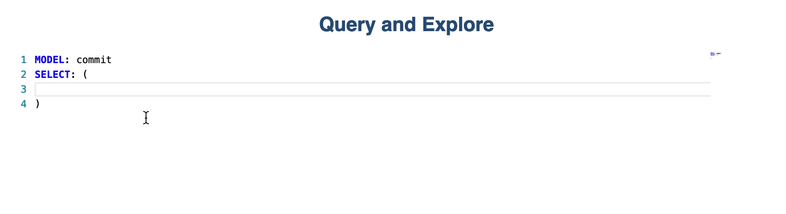
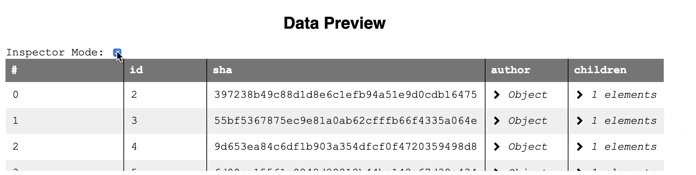

# Github Explorer

## Motivation

The available Github data in the Github database (PostgreSQL) are a powerful source for all kinds of software architecture and engineering questions.

But:

- hard to explore without background knowledge and a lot of implementation overhead
- large Database > 14 TB of data

## Design

The exploration process is divided into three steps. In the following, we will discuss the steps in detail.

### 1. Exploring the Schemata and Querying



We assume that the user has no background knowledge about the data and its schema in the database at the beginning of his or her research journey. Therefore, the user needs a way to explore the schemata in an easy way that allows him or her formulate queries at the same time.

To solve this, we developed a _custom query language_ and implemented a theme and completions for that language in an editor in lively.

The _custom query language_ allows the user to explore the data in a natural manner. At first, the user selects a model which is then used as the base for further explorations and querying.

By hitting `Contol + Space` completions are displayed the user can select relations or fields on every hierarchy level. Fields are listed with a _box_-icon and relations are listed with `{}`-icons. Completions on a deeper level, list relations, and fields for this level (relation). Therefore the user can traverse and explore the data relations.

By hitting `Control + Space` a second time while completions are shown, examples for the data can be seen.

After the query is formulated, the user can hit the button _Run Query_

### 2. Data Preview



After the query ran successfully, the user can explore the result in the _Data Preview_ section.

The data is displayed in a table. Row entries that are objects and therefore `n:1` relations are displayed as `Object`. The user can click on that and explore the values of these objects for every row. `m:n` relations or `1:n` relations are cells that contain the string `<Number of Elements> elements`. The user can click on these cells too, a table will then be displayed in that cell. The table contains ever elements as row and its fields and relations as columns.

`Objects`, `1:n`, `m:n` or whole rows can also be displayed in the _lively-inspector_ switching into inspector mode and clicking on rows or cells.

Refinement of the data can be done by query reformulation.
If the user is happy with the query results he or she can explore the data in the next step.

### 3. Visualization and Exploration


The data-explorer is opened in another window.

Parts of the data can be selected by setting the start and end index to the desired value.

Then the user can choose between different visualization.

Every visualization requires a special form of data. E.g. a bar chart requires a name for every bar and a value to set the bar heights. The name can be a string or a number (a primitive) and the value must be a number. But a radial tree requires completely different parameters.

Therefore for every visualization type, the corresponding parameters are displayed that can be chosen by the user. As already mentioned, each parameter requires a specific type of data. Therefore the user can only select suitable fields for each parameter.

Radial trees or simple trees can display the data down to deeper levels of the hierarchy of the data. By typing in the name of a field of an object the user can choose the desired field that is used on every level of the data hierarchy for the rendering. The data explorer will then rename these fields to the required value by the visualization.

## Implementation

We will discuss some implementation details in the following.

### Editor

The completion and the editor itself is implemented using the [Monaco Editor](https://microsoft.github.io/monaco-editor/). We implemented a custom language `ghExplorer` and a custom theme `ghExplorerTheme`.

The completions are dynamically built using the information that is given by an endpoint of the RestfulAPI that implements the parser and ORM for the custom query language.

### Visualization

The data explorer is implemented as a standalone lively component. By setting `setData(data)` the data can be set upon it displays the visualizations. The data has to be a list of objects.

Adding new visualizations is simple as the visualizations are implemented by using the lively-d3 components.
To register a new visualization you will only need to add it to `visSettings` and implement a "data translation" and rendering method that translated the data into the required form of the data and append the component as desired to the `DataExplorer.visualizationEL`. (sample methods are `DataExplorer.renderTreeType()`, `DataExplorer.renderBubbleChar()`)

The settings for every visualization contain information about the required parameters.

For example, the settings for the radial tree are:

```js
{
  'RadialTree': [
    {
      name: 'Name', // Name of the parameter
      type: 'primitive', // Type of the parameter
    },
    {
      name: 'Children', // Name of the parameter
      type: 'object', // Type of the parameter
      meta: [
        {
          name: 'Name',
          type: 'primitive'
        },
        {
          name: 'Size',
          type: 'primitive'
        }
      ]
    }
  ]
}
```

Every element in the list is a parameter that is displayed as a `<Select>` with options or rather fields of the data, that have the required data type.
In the case of a parameter that requires an object, optional parameters can also be set as `meta` property. These are displayed as `<Input>`. EventListeners are registered automatically to every parameter. The components can be later accessed as property `selection` or `input` of each parameter in the list. For example `visSettings.RadialTree[0].selection.value` accesses the value of the input for the parameter "Name" in the example above.
