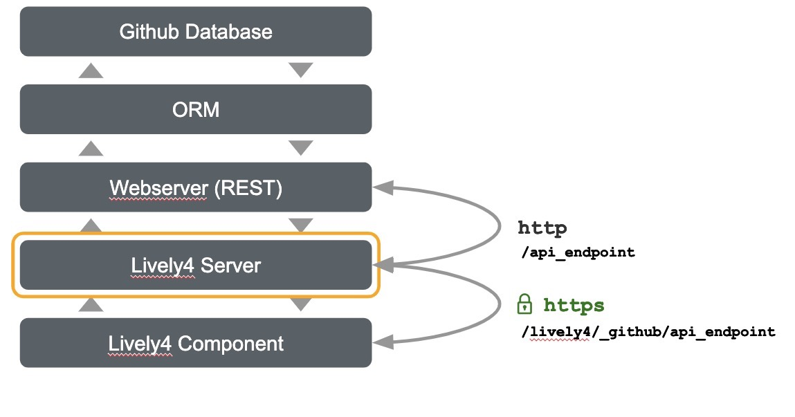

# Github Explorer

_Friedrich Schöne & Victor Künstler_

Datasets are growing quickly but at the same time, data scientists create analyses that get more and more complex. Typically, exploring data involves a broad collection of different technologies, tools and it also requires several steps do extract interesting insights. For that reason, the process of building such a workflow until the actual exploration requires a lot of implementation time which often consists of the same steps which requires background knowledge about the data and programming skills.
To reduce this implementation overhead and the need for background knowledge, we developed a tool to explore the data schema, query the data and explore the resulting data visually for a database containing GitHub data (e.g. commits, projects, authors, comments). We abstracted the data and the relations between tables with the help of an ORM.
To support the exploration of the schemata, we developed a custom query language, which, in contrast to traditional SQL, supports a more natural way of exploring data and handling relationships between data.
We extended a code editor to suggest completions and provide examples for different fields and relations based on the preceding selections.
We also provide a data preview that let the user quickly review his or her query results. For the last step, the visualization, we implemented a tool that lets the user visualize the data. This tool allows to configure the data used by the individual visualizations but at the same time does not limit the user on preconfigured visualization.

## Design

The exploration process is divided into three steps. In the following, we will discuss the steps in detail.

### 1. Exploring the Schemata and Querying


We assume that the user has no background knowledge about the data and its schema in the database at the beginning of the research journey. Therefore, the user needs a way to explore the schema in an easy way that allows to formulate queries at the same time.

To solve this, we developed a _custom query language_ and implemented a theme and completions for that language in an editor in lively.

The _custom query language_ allows the user to explore the data in a natural manner. At first, the user selects a model which is then used as the base for further explorations and querying.

By hitting `Contol + Space` completions can be displayed. The user can select relations or fields on every hierarchy level. Fields are listed with a _box_-icon and relations are listed with `{}`-icons. Completions on a deeper level list relations, and fields for this level (relation). The user can traverse and explore the data relations.

By hitting `Control + Space` a second time while completions are shown, examples for the data can be seen.

After the query is formulated, the user can hit the button _Run Query_

### 2. Data Preview


After the query ran successfully, the user can explore the result in the _Data Preview_ section.

The data is displayed in a table. Row entries that are objects, therefore `n:1` relations, are displayed as `Object`. The user can click on
these objects and explore its properties. `m:n` relations or `1:n` relations are cells that contain the string `<Number of Elements> elements`. The user can click on these cells, too. A table will then be displayed in that cell. The table contains every element as row and its properties as columns.

`Objects`, `1:n`, `m:n` or whole rows can also be displayed in the _lively-inspector_ by switching into inspector mode and clicking on rows numbers or cells.

Refinement of the data can be done by query reformulation.
If the user is happy with the query results he or she can explore the data in the next step.

### 3. Visualization and Exploration


The data-explorer is opened in another window.

Parts of the data can be selected by setting the start and end index to the desired value.

The user can choose between different visualization.

Every visualization requires a special form of data. E.g. a bar chart requires a name for every bar and a value to set the bar heights. The name can be a string or a number (a primitive) and the value must be a number. But a radial tree requires completely different parameters.

For that reason, for every visualization type, the corresponding parameters are displayed. These parameters can be chosen by the user. As already mentioned, each parameter requires a specific type of data. Therefore the user can only select suitable data objects for each parameter.

Radial trees or simple trees can display the data down to deeper levels of the hierarchy of the data. By setting the value to a name of a field of an object, the user can choose the desired field that is used on every level of the data hierarchy for rendering the visualization.

A count aggregation for lists of objects is done automatically. This additional field is listed as `<PropertyName>COUNT`.

## Implementation

We will discuss some implementation details in the following.

### Architecture



The connection to the backend is achieved by the implementation of a proxy on the lively4-server.

The backend and its documentation can be found [here](https://github.com/VictorKuenstler/lively4-github-explorer-server).

### Editor

The completion and the editor itself is implemented using the [Monaco Editor](https://microsoft.github.io/monaco-editor/). We implemented a custom language `ghExplorer` and a custom theme `ghExplorerTheme`.

The completions are dynamically built using the information that is provided by an endpoint of the RESTful API that implements the parser and ORM for the custom query language.

### Visualization

The data explorer is implemented as a standalone lively component. By setting `setData(data)` the data can be set upon the visualizations. The data has to be a list of objects.

Adding new visualizations is simple as the visualizations are implemented by using lively-d3 components.
To register a new visualization you only need to add it to `visSettings` and implement a "data translation" and rendering method that translates the data into the required form of the data and append the component to the `DataExplorer.visualizationEL`. (sample methods are `DataExplorer.renderTreeType()`, `DataExplorer.renderBubbleChar()`)

The settings for every visualization contain information about the required parameters.

For example, the settings for the radial tree are:

```js
{
  'RadialTree': [
    {
      name: 'Name', // Name of the parameter
      type: 'primitive', // Type of the parameter
    },
    {
      name: 'Children', // Name of the parameter
      type: 'object', // Type of the parameter
      meta: [
        {
          name: 'Name',
          type: 'primitive'
        },
        {
          name: 'Size',
          type: 'primitive'
        }
      ]
    }
  ]
}
```

Every element in the list is a parameter that is displayed as a `<Select>` with options, or rather fields of the data, that have the required data type.
In the case of a parameter that requires a list of objects or a single object, optional parameters can also be set as `meta` property. These meta parameters are displayed as `<Input>`. EventListeners are registered automatically to every parameter. The components can be later accessed as property `selection` or `input` of each parameter in the list. For example `visSettings.RadialTree[0].selection.value` accesses the value of the input for the parameter "Name" in the example above.
