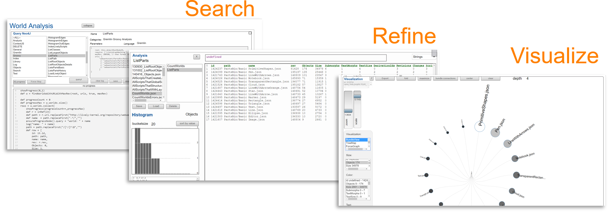

# Project 5: Friedrich Schöne,  Victor Künstler - Github-Explorer

## Project Descriptions

- GitHub as powerful data source for all kinds of software architecture and engineering questions
- **Goal:** Provide a *tool to explore GitHub data* in Lively4
  - Stream data for immediate feedback
  - User experience similar to the Lively Kernel World Explorer (explorable schemata, *tangible* results)

---

## Readings

-  ...

## Initial Task

- ...
