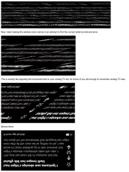
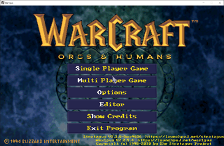
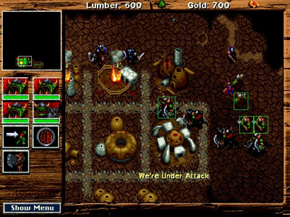

# Project 6: Noel Danz, Raoul Baron - Recovering Data

- New engines for old games
  - How do we recover the game data? What format is that in?
  - What does the binary tell us? Magic format bytes? Archives without headers? Run-length encoding? Endianness? Can we interactively explore, infer, and guide extraction?
- Example: Warcraft 1 DOS vs Mac version. Can we extract the dataset?
  - Drop the archive into a tool, start exploring subsets of the data, find the code, images, etc....
  
  

  

## Readings

- https://blogs.msdn.microsoft.com/oldnewthing/20180706-00/?p=99185
- https://github.com/Wargus/war1gus/issues/78
- http://www.blizzardarchive.com/pub/index.php?id=war1
