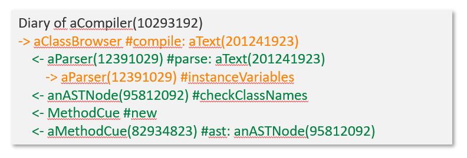

# Project 7: Jonas Beyer - The Program according to Garp

# Project Description

- Who called me? Whom did I call? What did we exchange? In which context did we do that? What is my general role in the application?
- Tracing from the perspective of a single object
- Making the data accessible through a graphical tool allowing for browsing and querying

# Readings

- Lienhard, Adrian, Stéphane Ducasse, and Tudor Gîrba. "Object flow analysis: taking an object-centric view on dynamic analysis." Proceedings of the 2007 international conference on Dynamic languages: in conjunction with the 15th International Smalltalk Joint Conference 2007. ACM, 2007.
- Vasily Kirilichev, Eric Seckler, Benjamin Siegmund, Michael Perscheid, and Robert Hirschfeld.Stepwise Back-in-time Debugging. In Proceedings of GI Informatiktage 2014, Potsdam, Germany, March 27-28, 2014, GI.

