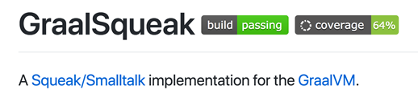
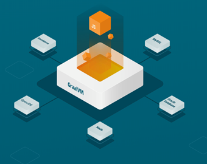
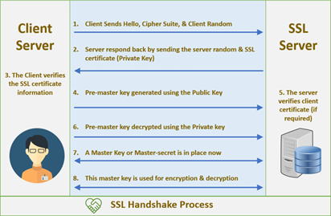

# Project 8: Falco Duersch - SSL Support in 

 

- Reverse-engineer SSL implementation in Smalltalk
- Build tools for visualizing/debugging SSL handshake
- **Goal:** Implement SSL plugin in Java for GraalSqueak

 