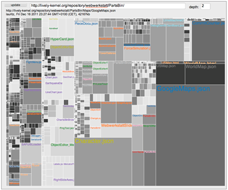

# Project 9: Melanie Schneider - Lively4 Semantic Code Overview

## Project Description

- Files vs. modules, classes, methods (JavaScript)
- Static and dynamic structure and dependencies
- Code coverage / system heat map

## Readings

- ...

## Settings
Enable preferences: 
- local file index
- use offline first swx cache
- (show grid)