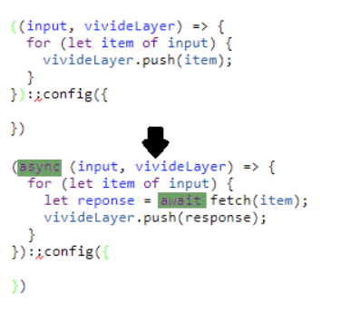

# Reactive Programming SS2018

<lively-import src="../_navigation.html"></lively-import>

## Projects

- [VivideJS](vivide-js/index.md)  {.thumb} {.project}

<lively-import src="../_logo.html"></lively-import>
<lively-import src="../_footer.html"></lively-import>