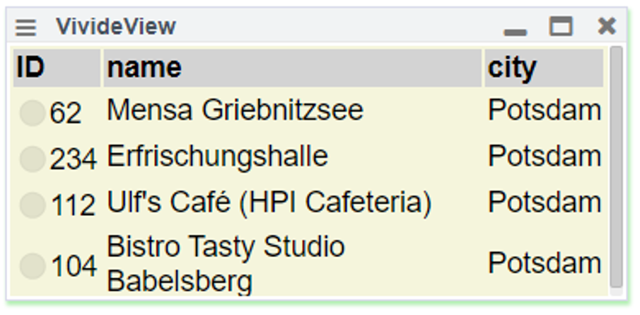

# RP WS 2019/20 Seminar (HPI)

<lively-import src="../_navigation.html"></lively-import>

## Info

- RP2019 @ https://github.com/LivelyKernel/lively4-seminars/ 
- edit it as [Lively4MarkdownWiki](https://lively-kernel.org/lively4/lively4-core/start.html?load=https://lively-kernel.org/lively4/lively4-seminars/RP2019/)
- Lively4
  - [https://github.com/livelykernel/lively4-core](https://github.com/livelykernel/lively4-core)
  - [https://lively-kernel.org/lively4/lively4-core/start.html](https://lively-kernel.org/lively4/lively4-core/start.html)

## Projects

- [Project 1:   Jonas Noack, Nico Scordialo  *Implementation of Active Expressions using JavaScript Proxies*](p1-proxies/index.md) {.thumb} {.project}
- [Project 2:   Leonardo Hübscher  *UI Programming with React/MobX vs Active Expressions*](p2-jsx/index.md) {.thumb} {.project}
- [Project 3:   Wilhelm Friedemann, Stephan Lutz  *Reveal Dependencies in Source Code*](p3-static-analysis/index.md) {.thumb} {.project}
- [Project 4:   Leon Bein  *Visualizing Runtime State and Dynamic Behavior*](p4-visualizing-behavior/index.md) {.thumb} {.project}
- [Project 5:   Eva Krebs  *Lively4 Connectors*](p5-connectors/index.md) {.thumb} {.project}
- [Project 6:   Jonas Grunert  *Composability and Reuse in VivideJS*](p6-vividejs/index.md) {.thumb} {.project}
- [Project X:   Tom Beckmann  *Example Tracing in Projectional Editors*](px-projectional-editor/index.md) {.thumb} {.project}
- [Project 0:   Stefan Ramson  *Active Expression Cleanup*](p0-aexpr-cleanup.md)  {.thumb} {.project}

<lively-import src="../_logo.html"></lively-import>
<lively-import src="../_footer.html"></lively-import>