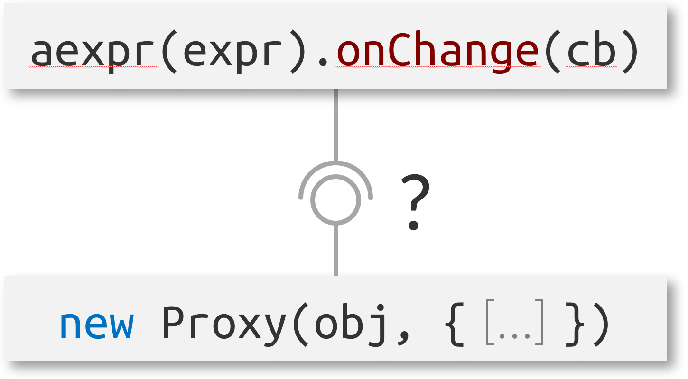

# Project 1: Implementation of Active Expressions using JavaScript Proxies

Goals:
- Implement a change detection strategy based on JavaScript Proxies in Lively 4
- Identify trade-offs: Compare with other implementation strategies
  - Conceptual limitations
  - Runtime overhead (performance benchmarks)
- Integrate into existing benchmark suite

Readings (to start with):
- Stefan Ramson and Robert Hirschfeld. *Active Expressions: Basic Building Blocks for Reactive Programming.* <Programming> 2017. ([pdf](https://www.hpi.uni-potsdam.de/hirschfeld/publications/media/RamsonHirschfeld_2017_ActiveExpressionsBasicBuildingBlocksForReactiveProgramming.pdf))
- Matthias Keil and Peter Thiemann. *Efficient dynamic access analysis using JavaScript proxies.* DLS 2013. ([pdf](https://arxiv.org/pdf/1312.3184.pdf))
- Tomas Kalibera and Richard E. Jones. *Rigorous Benchmarking in Reasonable Time.* ISMM 2013. ([pdf](https://kar.kent.ac.uk/33611/45/p63-kaliber.pdf))
