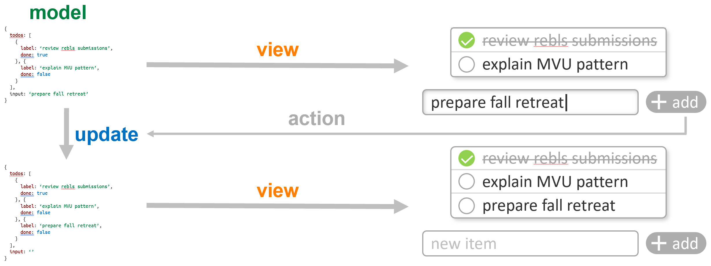

# Project 2: UI Programming with React/MobX vs Active Expressions

## Goals:

- Choose a real world MobX example ([link](https://github.com/gothinkster/react-mobx-realworld-example-app))
- Build a feature-equivalent application using Active Expressions in Lively4
  - Identify fitting reactive programming concepts and implement them as needed
- Compare your solution with reference example regarding code quality (fitting metrics) and performance criteria (benchmarks)

## Readings (to start with):

- Stefan Ramson and Robert Hirschfeld. *Active Expressions: Basic Building Blocks for Reactive Programming.* <Programming> 2017. ([pdf](https://www.hpi.uni-potsdam.de/hirschfeld/publications/media/RamsonHirschfeld_2017_ActiveExpressionsBasicBuildingBlocksForReactiveProgramming.pdf))
- Michele Lanza and Radu Marinescu. *Object-Oriented Metrics in Practice.* Springer 2006. (ask for book)
- Christopher Schuster. *Towards Live Programming Environments for Statically Verified JavaScript.* PhD Thesis 2018. ([pdf](https://chris-schuster.net/phd/phd_thesis.pdf))
- Stefan Ramson, Jens Lincke, and Robert Hirschfeld. *JSX Semantics for Plain HTML Elements.* unpublished. (ask for pdf)
