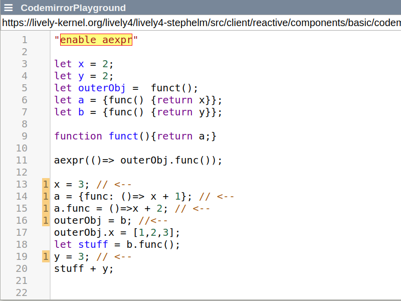

# Project 3: Reveal Dependencies in Source Code


## Goals:

1. Perform source code analysis to identify hidden dependencies
  - Determine state accessed by active expressions and the impact of an assignment
  - Incremental analysis in an online/interactive fashion
2. Enhance existing code editor (Code Mirror)
  - Present additional information in comprehensive way
  - Develop user interactions to navigate hidden dependencies

## Readings (to start with):

- Stefan Ramson and Robert Hirschfeld. *Active Expressions: Basic Building Blocks for Reactive Programming.* <Programming> 2017. ([pdf](https://www.hpi.uni-potsdam.de/hirschfeld/publications/media/RamsonHirschfeld_2017_ActiveExpressionsBasicBuildingBlocksForReactiveProgramming.pdf))
- Andreas Zeller. *Why Programs Fail: A Guide to Systematic Debugging.* dpunkt 2005. (ask for book)


## Documentation:

We built a Graph structure capable of providing most information to find dependencies and embedded it into the [AST-Capabilities] of the [Codemirror]. For Documentation purposes we left the original [Dependencygraph] in Lively. We did this in order to show where Active Expressions (AE) are triggered and vice versa for a more comprehensive workflow with AE.

Technically, for us an AE is a CallExpression that has some Expression as argument. Our goal was it to find every place in the code, which altes the result of that Expression.



In the picture, every line with `//<-` may alter the result of the AEs argument and is found (indicated by the guttermarkers) correctly (if one does not care about execution order).


## Assumptions
 * the body of an AE contains an ArrowFunctionExpression
 
## Approach

### Collecting Dependencies Statically
This approach was chosen, because we do not want the AE to live in the system when collecting dependencies. When collecting dependencies, the programmer either is not finished implementing or is using our tool debug/ understanding the code better. In both cases the living AE could lead to unexpected behavior and corrupted state in the environment.

This approach brings some disadvantages as well. We have to collect information from the source code without being able to use the tools and possibilities of our environment or the AE implementation itself. Thus, and due to the partition of the system into many files/ASTs an early limitation was finding trigger/dependencies across files. In order to resolve dependencies in other files, we would have to map Objects/Variables across these files, which is hard because of JS itself. 
An other disadvantage is that we have to reimplement what the original implementation of AE already does.

## Touched Files
* [Dependencygraph(folder)] - The original Implementation
* [AST-Capabilities] - Embedding into already existing AST of the Codemirror
* [Codemirror] - Adding extra Gutter for revealing active Expressions that are triggered by a line of code

## Usage (currently only in CodeMirror Playground)

### See trigger of an Active Expression
 * Click on Active Expression
 * Hit `Alt-a` 
 * All occurences that trigger the Active Expression are highlighted in orange
### See Active Expression triggered by a line of code
 * Number of Active Expressions triggered is shown in the extra gutter
 * Click on the number to see all Active Expressions triggered
 
## Features and Limitations
 
 ### Supported:
 * Any state(Variables) or calls(Callexpressions) that comes from higher scopes (dependencies)
 * Objects
 * Member (Membercalls)
 * Any depth of circularity
 * `This` - not explicitly supported but the current architecture is able to treat it as a normal Object
 
 ### NOT Supported
 * Computed Properties - static analysis cannot determine these before runtime
 * `delete` - the switch from some value to undefined is not found
 * Circular call constructs, where a single Function is part of 2 or more circles (can be changed via `visited` and `returnVisited`).
 * Irrelevant dependencies e.g. `aexpr(()=> {x + x; return y;})` `x` will be detected
 * Execution order
 * Leave the file scope
 * Some not yet implemented expressions

## How does it work?
The process is split into two steps - enrichment and collect step

### Enrichment see [Dependencygraph]>>enrich
This is a preprocessing step that is done once for the entire AST. It adds important and necessary information to the AST nodes by traversing the AST multiple times.
These information are:
* bindings for every Identifier (to collect constantViolations)
* objects/leakingBindings for every Scope (to resolve the dependencies later on)
* resolvedObjects for every Expression (to resolve possible Callees on MemberExpressions as callees)
* resolvedCallees for every Callexpression (to find the important scopes for the dependency collection and being able to infer the return value of a CallExpression)
* returns for every Function (to able able to infer the return value of a CallExpression)

Note that the last both information directly depend on each other:
```
foo().bar()
```
In order to resolve the Callee and MemberExpression `foo().bar` we need to know to what `foo()` resolves in the first place and so on. 
So you may see in addition to the traversals seemingly redundant recursion.

### Collect - [Dependencygraph]>>resolveDependencies

After enriching once, we handle every query via recursion over every CallExpression of the current scope. Writing out the `constantViolations` for everything results in the wanted information.

## Discussion

### DependencyGraph
The amount of implemented dependency collection is enough to reveal some (hidden) dependencies the programmer forgot, missed due to typos (most often in our case) or did not see in general. The goal of revealing dependencies globally could not be reached due to the limitations of our approach. Furthermore we decided to rather show the correctly found dependencies than to show too many wild guesses of uncertain dependencies. And every dependency across a file is a guess. However there are still false negatives, either if the programmer does weird things (not sorry for that) or when the dependency collection stops too early due to ambiguous or unresolvable Expressions (sorry for that).

### UI
We think that AE support should be small and hidden until required. But when AE are allowed in a file the programmer should always be aware of that. We think that our tooling does that. There could be an indication WHY a dependency exists (stored in graph, but not visualized), but in our experience, they are usually pretty obvious if the programmer has the AE and the trigger as well.

### Overall
Our project cannot provide SAFE and RELIABLE information for AE. Especially for cross-file dependencies, where the programmer is not aware of the existence of AE and his comprehension of the other file is not necessarily given, we fail our aim. But in our experience, if the file borders are chosen modular and the APIs are clear, crossfile dependencies are not required that much.  


[Dependencygraph(folder)]:https://lively-kernel.org/lively4/lively4-stephelm/src/client/dependency-graph/
[Dependencygraph]:https://lively-kernel.org/lively4/lively4-stephelm/src/client/dependency-graph/graph.js
[Codemirror]:https://lively-kernel.org/lively4/lively4-stephelm/src/components/widgets/lively-code-mirror.js
[AST-Capabilities]:https://lively-kernel.org/lively4/lively4-stephelm/src/components/widgets/lively-code-mirror-ast-capabilities.js
