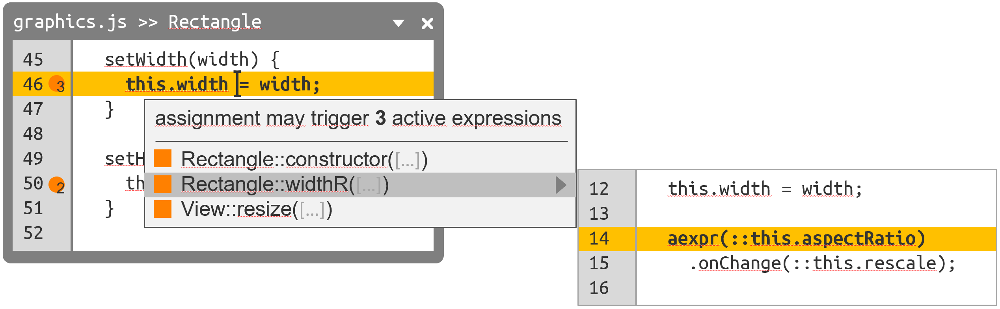

# Project 3: Reveal Dependencies in Source Code

## Goals:

1. Perform source code analysis to identify hidden dependencies
  - Determine state accessed by active expressions and the impact of an assignment
  - Incremental analysis in an online/interactive fashion
2. Enhance existing code editor (Code Mirror)
  - Present additional information in comprehensive way
  - Develop user interactions to navigate hidden dependencies

## Readings (to start with):

- Stefan Ramson and Robert Hirschfeld. *Active Expressions: Basic Building Blocks for Reactive Programming.* <Programming> 2017. ([pdf](https://www.hpi.uni-potsdam.de/hirschfeld/publications/media/RamsonHirschfeld_2017_ActiveExpressionsBasicBuildingBlocksForReactiveProgramming.pdf))
- Andreas Zeller. *Why Programs Fail: A Guide to Systematic Debugging.* dpunkt 2005. (ask for book)
