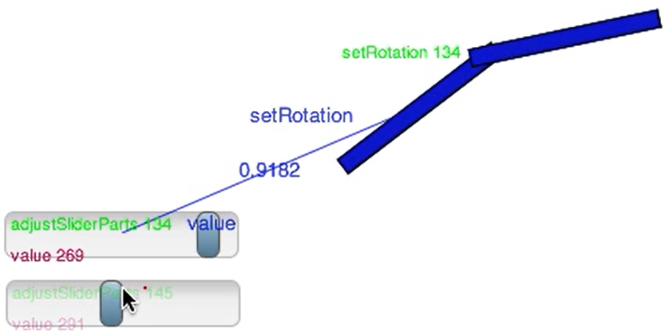

# Project 5: Lively4 Connectors

## Goals:

- Implement a unidirectional dataflow mechanism for properties of graphical objects using active expressions
- Design and implement a graphical user interface to interactively create dataflow and event connections
- Persist created connections into existing PartsBin
- Create a non-trivial example application using connectors

## Readings (to start with):

- Stefan Ramson and Robert Hirschfeld. Active Expressions: Basic Building Blocks for Reactive Programming. <Programming> 2017. (pdf)
- Jens Lincke. Evolving Tools in a Collaborative Self-supporting Development Environment. Doctoral Dissertation 2014. (ask for pdf)
- Jens Lincke and Hirschfeld. User-evolvable Tools in the Web. FLOSS 2013. (pdf)
- Jens Lincke, Robert Krahn, Dan Ingalls, Marko Röder, and Robert Hirschfeld. The Lively PartsBin – A Cloud-based Repository for Collaborative Development of Active Web Content. HICSS 2012. (pdf)
