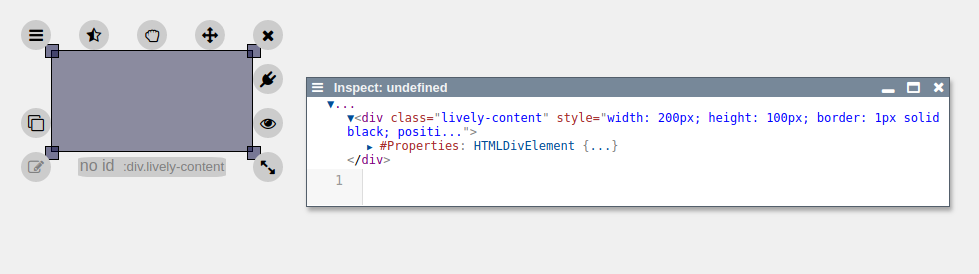
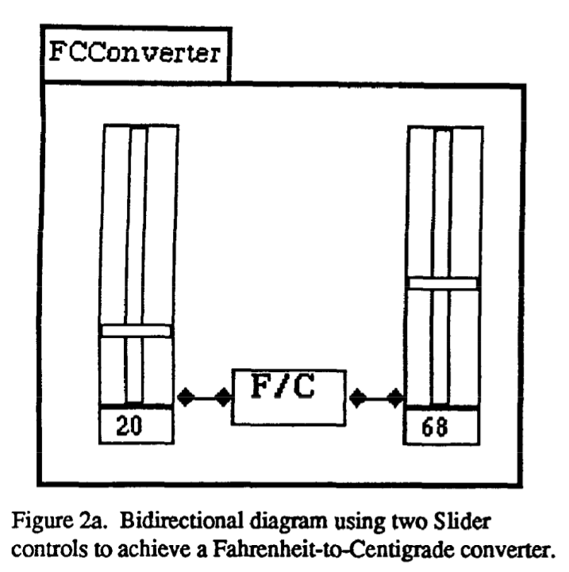
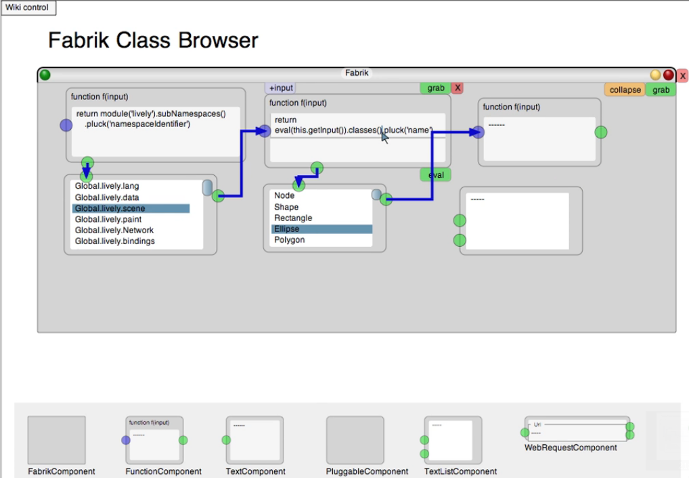
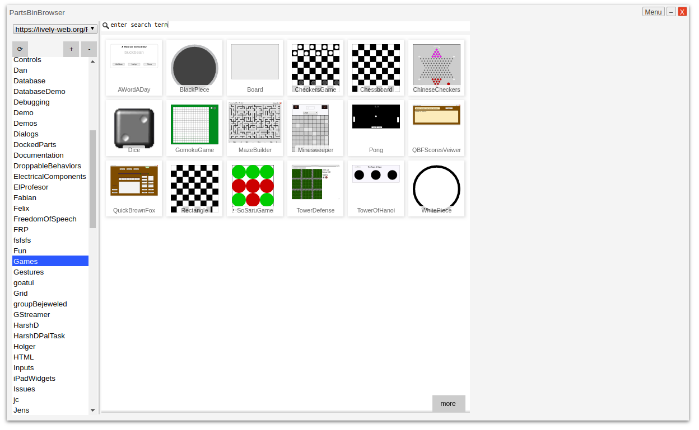

<!-- markdown-config presentation=true -->

<!-- #TODO make style links in container content relative to url -->
<!-- <link rel="stylesheet" type="text/css" href="style.css" /> -->
<link rel="stylesheet" type="text/css" href="./style.css"  />
<link rel="stylesheet" type="text/css" href="../../src/client/lively.css"  />
<link rel="stylesheet" type="text/css" href="../../templates/livelystyle.css"  />

<!--

-->

  Lively4 Connectors

  Eva Krebs

  Reactive Programming 2019, 26.11.2019 Midterm 
   
  Jens Lincke, Stefan Ramson, Robert Hirschfeld (Software Architecture Group)

---

# Agenda

---
# Lively4

- Interactive
- Live
- Halos

---
# Fabrik

- 1988

---
# Lively Fabrik Browser

---
# Lively Connectors

<embed src="./media/connectors.mp4" autostart="false" height="500" width="800" />

- https://lively-web.org/

---
# Lively Connectors

<embed src="./media/120313_TallyConnections.mp4" autostart="false" height="500" width="800" />

---

# Lively Connectors

<embed src="./media/120313_VisualizeConnections.mp4" autostart="false" height="500" width="800" />

---
# Lively Connectors

<embed src="./media/test.mp4" autostart="false" height="500" width="800" />

---
# Lively PartsBin

---

# Concepts

- Objects in world / morphs
  - Source
  - Target
  - Their respective properties
  - "Combine widgets into bigger widget"
- Connection
  - Connects source and target
  - Reactive
  - Drawable/Debuggable?
- Connection hub / editor

---
# Lively4 Connectors

## Add a way to create connections in Lively4

- Add connector ui element into domain (= halos)
- Selecting source, target, and their properties
- Editing/Deleting connections
- Debugging/Visualizing connections
- Save new widgets (PartsBin?)

---
# Lively4 Connectors

## Reactive?
- Dataflows, user interaction, visual
- Active Expressions
- Events

---
# Demo

 42

<input id="slider" type="range"> </input>

---
# Current state

- New Connectors Halo item
- Selecting source and target as well as their properties
- First Connections work

---
# Next Steps

- Improved connection creation
  - Whitelist (or similiar) of often used and available properties
  - Improved custom properties/connections
- Connection hub (with connection editing / removing)
- More connection debugging (e.g. visualizations)
- PartsBin

---