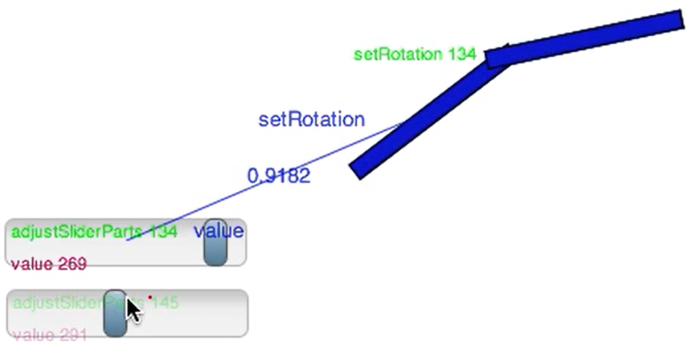

<!-- markdown-config presentation=true -->

<!-- #TODO make style links in container content relative to url -->
<!-- <link rel="stylesheet" type="text/css" href="style.css" /> -->
<link rel="stylesheet" type="text/css" href="./style.css"  />
<link rel="stylesheet" type="text/css" href="../../src/client/lively.css"  />
<link rel="stylesheet" type="text/css" href="../../templates/livelystyle.css"  />

<!--

-->

  Lively4 Connectors

  Eva Krebs

  Reactive Programming 2019, 26.11.2019 Midterm 
   
  Jens Lincke, Stefan Ramson, Robert Hirschfeld (Software Architecture Group)

---

# Agenda

---
# Lively Connectors

<!---->

## Goals:

- Implement a unidirectional dataflow mechanism for properties of graphical objects using active expressions
- Design and implement a graphical user interface to interactively create dataflow and event connections
- Persist created connections into existing PartsBin
- Create a non-trivial example application using connectors

---
# Demo

---
# Implementation
##  Halo Item

- New Halo-Item-class
- Save source, source property, target, and target property
- Click Handling?
- Maybe diagram?

---
## Connections

- Own class
- Hub
- Editing
- Debugging, drawing?

---
# Next Steps
 
- Finish Hub & Connection Editing
- Better UI for custom connections
- Whitelist of properties
- More Debugging Options
- Example application / use case

---
# Future Work

- More Dynamic whitelist of properties
- PartsBin

---