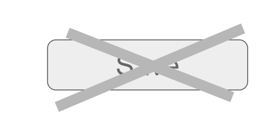

# SWD 2015 Seminar (HPI)

<lively-import src="../_navigation.html"></lively-import>

[**Topics**](topics.md) [**Whiteboards**](whiteboards.md)

- [Project 1](project1.md)   Astrid Thomschke, Daniel Werner, Felix Wolff   *Thin Morphic*  {.thumb} {.project}
- [Project 2](project2.md)  Jan Lindemann, Daniel Stolpe   *Shadow DOM Persistence*   {.thumb} {.project}
- [Project 3](project3.md)  Philipp Pajak, Timo Djürken   *ObjectEditor*   {.thumb} {.project}
- [Project 4](project4.md)  Meike Baumgaertner, Jan Graichen   *Unified backend API*   {.thumb} {.project}
                                                                                            

<lively-import src="../_logo.html"></lively-import>
<lively-import src="../_footer.html"></lively-import>
