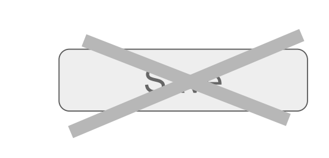

# Project 2: Jan Lindemann, Daniel Stolpe - *Shadow DOM Persistence*

[**presentation**](presentation.pdf)

Morphic on Shadow DOM:
- Full control over UI and User data changes

State vs. History of changes:
- Continuously observe state changes (shadow DOM)
= Static representation as readable HTML5 file

Idea: Files in Git repository are snapshot of a history of changes. Both perspectives are useful. 

Goal: Get rid of the save button

<lively-import src="../../_logo.html"></lively-import>
<lively-import src="../../_footer.html"></lively-import>