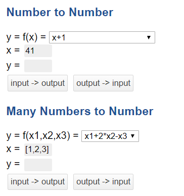
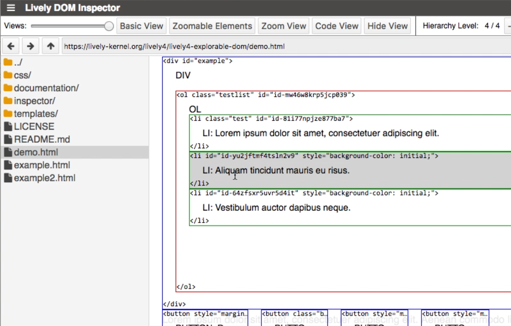
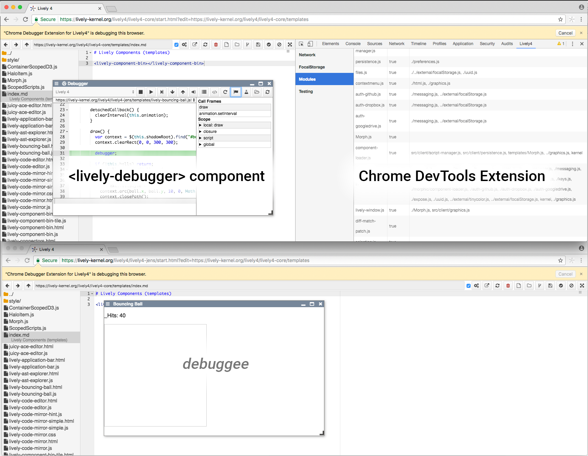
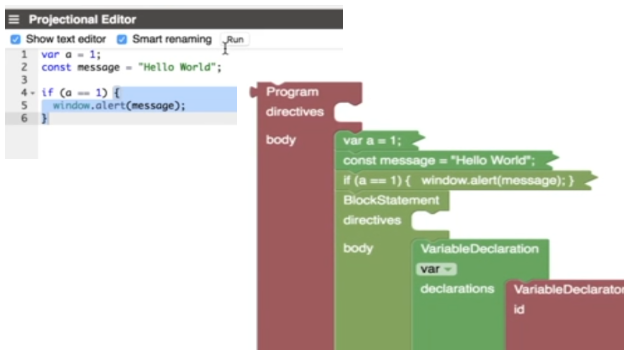

# SWD 2016 Seminar (HPI)   Evolving the Lively4 Web-based Development Environment

<lively-import src="../_navigation.html"></lively-import>

The seminar will build upon the results of our previous [SWD](SWD15) and [WebDev](WebDev16) seminars.
The development environment runs 100% in the browser and can therefore be served from static [github.io](https://livelykernel.github.io/lively4-core/draft/start.html?load=/README.md) pages and use GitHub, Dropbox and other Cloud APIs for persistence. 
For faster development and other experiments we also have our very basic node.js service, that gives us more control during development. 
We can for example navigate and edit on [our server on lively-kernel.org](https://lively-kernel.org/lively4/lively4-core/draft/start.html?load=https://lively-kernel.org/lively4/lively4-seminars/SWD2016/). [Getting started.](help.md)

# Projects

## [1  Jonas Chromik, Christopher Weyand: *Non-linear Constraint Solving*](project1.md)  
{.thumb}

## [ 2  Henriette Dinger, Dominic Sauer: *Explorable DOM*](project2.md)
{.thumb}
 

## [3 Fabio Niephaus, Sebastian Koall: *Abstraction-aware Debugging*](project3.md)
{.thumb}

## [4 Babel Projectional Editor](project4.md) 
{.thumb}

##  [5 Particle-based Simulations](project5.md)  
{.thumb}

