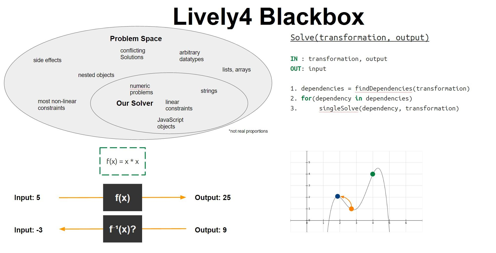

# Project1 Jonas Chromik, Christopher Weyand:   *Non-linear Constraint Solving*

## 

[**repository**](https://lively-kernel.org/lively4/lively4-blackbox/README.md) [**slides**](slides.pdf)

Live programming environments provide a comfortable and intuitive development
process. To achieve consistency between variables and still support context
manipulation during runtime, optimization problems have to be solved to find a
consistent constellation among the variables while still obeying the
user-specified constraints (for example, a variable having a given value). We
solve such problems without any information about the function and therefore
without reduction of the languages expressiveness. In other words: We try to
calculate the inverse of a black-box function and a specific dataset. As it turns
out, this is neither easy nor always possible. Still, a considerable amount of
research deals with this topic, thus giving a hint about the depth and
complexity of the field. However, instead laying focus on theory, our project
presents an intuitive way to approach the problem. Without loss of generality,
we assume the input and output is a JavaScript-Object; i.e. in the form of
key-value pairs. Our implementation is written in JavaScript using Lively4 and
is based on evolutionary algorithms.

<video width="640" height="480" controls><source src="screencast.mp4" type="video/mp4"></source></video>