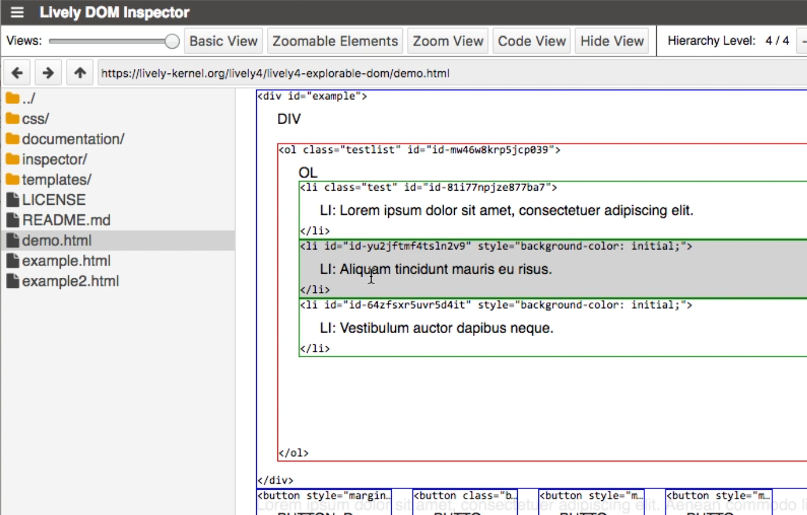

# Project 2 Henriette Dinger, Dominic Sauer :  *Explorable DOM*

[**repository**](https://lively-kernel.org/lively4/lively4-explorable-dom/README.md) [**slides**](lively_dom_inspector.pdf)

Bridge gap between object/code structure and UI 
- Stepwise transfer from rendered page to code 
- Visualize DOM structure 
- Explore different aspects of the page in single views 

→ Easier to understand relation between code and the resulting layout

<video controls><source src="screencast.mp4" type="video/mp4"></video>